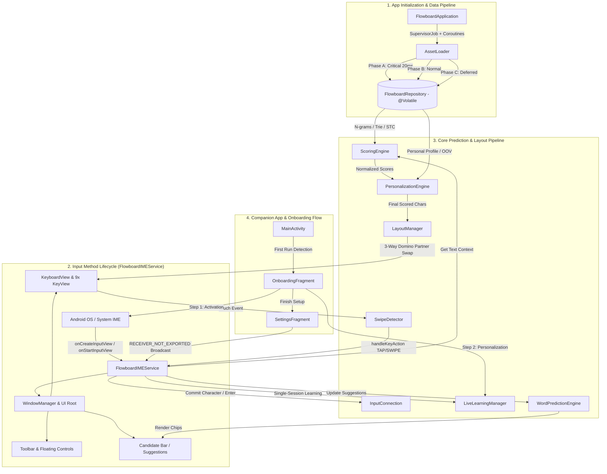
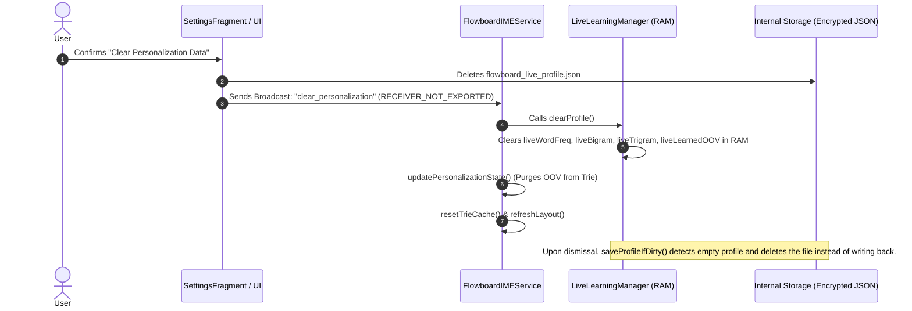

# 🏗️ Flowboard Android — System Architecture & Technical Documentation

This document serves as the comprehensive technical reference for software engineers, system architects, and open-source contributors. It covers Flowboard's component architecture, execution lifecycle, complete module function catalog, n-gram scoring pipeline, adaptive machine learning subsystem, and the **Impact Analysis Matrix**.

---

## 1. System Architecture Overview

Flowboard Android is an intelligent 9-key keyboard engineered on a **100% Offline Prediction Engine**, with zero external network connectivity, hardware-backed encryption, and rigorous security hardening.



---

## 2. Project & Package Structure

```text
app/src/main/
├── java/com/flowboard/ime/
│   ├── FlowboardApplication.kt            # Application Entry Point & 3-Phase Coroutine Asset Pipeline
│   ├── MainActivity.kt                    # Companion App Router, Status Poller, Navigation Chrome Controller
│   ├── data/
│   │   ├── AssetLoader.kt                 # Coroutine IO JSON Deserializer (Optional OOV parsing)
│   │   ├── FlowboardRepository.kt         # In-Memory RAM Singleton with @Volatile memory barriers
│   │   ├── ClipboardManagerHelper.kt      # Local Clipboard Storage (LRU 30 items, Pin support)
│   │   ├── EmojiRepository.kt             # 9-Category Emoji Store & Recent Emojis Manager
│   │   └── models/
│   │       ├── ClusteredWordBigram.kt     # Group-compressed Word Bigram / Trigram model
│   │       ├── EngineWeights.kt           # Weights for 7 Sub-engines across 6 Context States
│   │       ├── KeySlots.kt                # 5-directional character container (tap, up, left, right, down)
│   │       ├── MasterLayout.kt            # 36-char placement mapping (homeKey, defaultSlot)
│   │       ├── PersonalProfile.kt         # User-specific bigram, trigram, wordFreq, learnedOOV
│   │       ├── Profile.kt                 # System typing rules (allow_echo, buffs, immunity)
│   │       └── TrieNode.kt                # Prefix Trie Node Data Structure (freq, endOfWord, children)
│   ├── engine/
│   │   ├── LanguageManager.kt             # Shift & CapsLock state machine (OFF / SHIFT_ONCE / CAPS_LOCK)
│   │   ├── LayoutManager.kt               # 3-Way Domino Partner Swap algorithm (36 slots mapping)
│   │   ├── LiveLearningManager.kt         # Real-time OOV learner, Capacity-Driven Aging, Atomic .tmp Swap
│   │   ├── PersonalizationEngine.kt       # Additive zero-degradation user scoring layer
│   │   ├── ProfileManager.kt              # Profile Switcher (DEFAULT vs CHAT mode with profile_chat.json)
│   │   ├── ScoringEngine.kt               # 6-State Contextual 7-Sub-Engine Fusion & Precomputed DECAY_POWERS
│   │   └── WordPredictionEngine.kt        # Candidate Autocomplete, Next-Word, Prefix resolution
│   ├── service/
│   │   └── FlowboardIMEService.kt         # Hardened IME Service (No Leaks, IPC Security, Incognito & Sensitive Filters)
│   ├── testing/
│   │   └── BotTester.kt                   # Automated simulation harness with precompiled Regexes
│   ├── ui/
│   │   ├── EmojiAdapter.kt                # RecyclerView Adapter for Emoji Grid
│   │   ├── KeyView.kt                     # Canvas-rendered 9-grid key (Zero GC churn in onDraw)
│   │   ├── KeyboardView.kt                # Custom 3x3 ViewGroup managing 9 KeyViews
│   │   ├── SwipeDetector.kt               # 5-directional gesture recognition (TAP, UP, DOWN, LEFT, RIGHT)
│   │   ├── onboarding/
│   │   │   └── OnboardingFragment.kt      # 2-Step First-Launch Setup Wizard (Activation & Personalization)
│   │   └── settings/
│   │       ├── AboutFragment.kt           # App Information, Version, Security & Support Links
│   │       ├── AdvancedTuningFragment.kt  # Developer Mode Engine Tuner (Ratios, Layout, Weights)
│   │       ├── PersonalizationFragment.kt # Settings for Live Learning, OOV, Multipliers, Storage Info
│   │       ├── SettingsFragment.kt        # Master Settings UI & Live Activation Status Checker
│   │       ├── ShortcutsFragment.kt       # Quick Text Snippets Editor (Keys 1-9)
│   │       ├── SidebarSettingsFragment.kt # Left/Right-handed Docked & Floating Controls
│   │       └── ThemesFragment.kt          # Theme Selector UI (7 Curated Themes)
│   └── util/
│       ├── AdvancedTuningFormatter.kt     # Easy Text & JSON Bidirectional Formatter and Parser
│       ├── DensityUtil.kt                 # Display metrics and DP/PX calculation helpers
│       ├── SoundHapticManager.kt          # Waveform haptics & SoundPool feedback controller
│       └── ThemeManager.kt                # Dynamic Theme Application & Palette Engine
```

---

## 3. Comprehensive Function Catalog

### 3.1 Data Layer (`data/`)

#### `AssetLoader.kt`
* `loadCriticalData(repo: FlowboardRepository): Unit` (suspend)
  * **Input:** `FlowboardRepository`
  * **Output:** Loads `unigram`, `master_layout`, `symbol_page_1/2` and invokes `repo.markReady()` (~20ms).
* `loadNormalData(repo: FlowboardRepository): Unit` (suspend)
  * **Input:** `FlowboardRepository`
  * **Output:** Loads `bigram`, `trigram`, `trie_dict_compressed`, `word_list`, `clustered_word_bigram`, `unigram_start`, and `profile_chat`.
* `loadDeferredData(repo: FlowboardRepository): Unit` (suspend)
  * **Input:** `FlowboardRepository`
  * **Output:** Loads `trie_dict_oov`, `clustered_word_trigram_en`, `sentence_topic_clusters`, `my_personal_profile` and invokes `repo.markFullyLoaded()`.
* `loadPersonalProfile(path: String): PersonalProfile`
  * **Input:** JSON file path of the user profile.
  * **Output:** Deserializes `bigram`, `trigram`, `wordFreq`, and `learnedOOV`.

#### `ClipboardManagerHelper.kt`
* `getItems(): List<ClipboardItem>`
  * **Output:** All stored clipboard items, sorted by Pinned status and creation timestamp.
* `addClip(text: String): ClipboardItem?`
  * **Input:** New text `String` (filtered through sensitive field checks).
  * **Output:** Appends text to clipboard history (bounded by LRU 30-item capacity, preserving pinned items).

---

### 3.2 Core Prediction & Scoring Engine (`engine/`)

#### `ScoringEngine.kt`
* `calculateScores(text: String): Map<String, Double>`
  * **Input:** Previous text context before cursor (`text`).
  * **Output:** Map of predicted character probability scores for all 26 alphabetic characters (`a-z`) and symbols.
* `evaluateBranch(branchRoot: TrieNode, totalWords: Int, isOOV: Boolean, decay: Double, maxDepth: Int): Double`
  * **Output:** Traverses Trie branches utilizing precomputed `DECAY_POWERS_0_80` table instead of expensive `Math.pow`.
* `isDoubleCharValid(text: String, lastChar: String): Boolean`
  * **Input:** Historical input text and target character.
  * **Output:** Validates double-character repetition rules against dictionary constraints and personal typing history.

#### `ProfileManager.kt`
* `switchProfile(mode: ProfileMode): Unit`
  * **Input:** `ProfileMode.DEFAULT` or `ProfileMode.CHAT`.
  * **Output:** Switches active typing profile between standard typing and conversational chat (`profile_chat.json`), dynamically refreshing `bonusDict`.

#### `LiveLearningManager.kt`
* `writeProfileFile(file: File, content: String): Unit`
  * **Output:** Writes encrypted payload to a temporary file `${file.name}.tmp` followed by an atomic filesystem rename, guaranteeing zero data corruption during unexpected process termination.

---

### 3.3 Service & UI Layer (`service/`, `ui/`, `util/`)

#### `FlowboardIMEService.kt`
* `onFinishInputView(finishingInput: Boolean): Unit`
  * **Output:** Flushes sentence-level learning and writes dirty profiles to disk within a deduplicated session (prevents triple word duplications).
* `isLearningAllowedForCurrentField(): Boolean`
  * **Output:** Inspects input field variations and detects `EditorInfo.IME_FLAG_NO_PERSONALIZED_LEARNING` (halting learning in Incognito / Private Browsing).
* `onDestroy(): Unit`
  * **Output:** Unregisters `primaryClipListener` from `ClipboardManager` to prevent system service memory leaks.

#### `KeyView.kt`
* `onDraw(canvas: Canvas): Unit`
  * **Output:** Renders key surfaces using static companion character sets, eliminating heap allocations during draw passes (Zero GC Churn).

#### `SoundHapticManager.kt`
* `performSwipeVibration(): Unit`
  * **Output:** Delivers waveform haptic vibration on amplitude-capable hardware with automatic fallback to single-shot vibration on Android 8.0–9.0.

---

## 4. Impact Analysis Matrix

| Target Component / Method | Incoming Callers | Outgoing Dependencies | Blast Radius / Failure Impact |
|---|---|---|---|
| **`FlowboardRepository`** (Singleton) | Universal (Engine, UI, Service) | `StateFlow`, `@Volatile` fields | 🔴 **CRITICAL (System-Wide):** Manages shared cross-thread in-memory state. |
| **`FlowboardIMEService.onFinishInputView()`** | Android IME Lifecycle | `LiveLearningManager.recordWordTyped()`, `saveProfileIfDirty()` | 🔴 **CRITICAL:** Controls single-session sentence learning and avoids word duplication. |
| **`LiveLearningManager.writeProfileFile()`** | `saveProfileIfDirty()` | `EncryptedFile`, `.tmp` Atomic File Swap | 🔴 **CRITICAL:** Guarantees on-disk profile integrity and crash resilience. |
| **`FlowboardIMEService.onDestroy()`** | Android OS Lifecycle | `clipboardManager.removePrimaryClipChangedListener()` | 🔴 **CRITICAL:** Prevents system-level memory leaks upon keyboard teardown. |
| **`FlowboardIMEService.isLearningAllowedForCurrentField()`** | `onFinishInputView()`, `recordWordTyped()` | `IME_FLAG_NO_PERSONALIZED_LEARNING`, Password Check | 🟠 **HIGH (Privacy):** Enforces privacy boundaries in Incognito / Private Browsing. |

---

## 5. Capacity-Driven Watermark Forgetting Architecture

```
                  ┌─────────────────────────────────────────────────────────┐
                  │              Total Capacity: 1,000 Words                │
                  └─────────────────────────────────────────────────────────┘
                                               ▲
                                               │
   [ 0% - 84% Capacity ] ──────────────────────┼──► SAFE ZONE: 0% Decay (Zero Forgetting)
   (Fewer than 850 words)                      │   Light users / Inactive periods 100% protected
                                               │
   [ ≥ 85% High Watermark ] ───────────────────┼──► HIGH WATERMARK TRIGGER: Exponential Decay
   (850+ words stored)                         │   - Prunes one-off typos (< 1.0)
                                               │   - Words with count ≥ 3 receive Floor Protection (>= 1)
                                               │
   [ Decay Runs Every 500 Words Typed ] ───────┴──► Inspection cadence (WORDS_BETWEEN_DECAY_CHECK)
```

$$\text{isCapacityPressureHigh}() = (\text{liveWordFreq.size} \ge 850) \lor (\text{liveBigram.size} \ge 1700)$$

$$\text{newCount} = \begin{cases} 
\text{count} & \text{if } \text{isCapacityPressureHigh}() = \text{false} \text{ (Safe Zone)} \\
\max(1, \text{round}(\text{count} \times 0.95)) & \text{if } \text{count} \ge 3 \text{ (High-Frequency Immunity Floor)} \\
\text{round}(\text{count} \times 0.95) & \text{if } \text{decayed} \ge 1.0 \\
0 \text{ (Pruned from Memory \& Disk)} & \text{if } \text{decayed} < 1.0 \text{ (Typo Elimination)}
\end{cases}$$

---

## 6. Personalization State Lifecycle (Clear Data Sequence)



---

## 7. Security & Encryption Policy

1. **100% Offline IME (Zero Network Permission):** No `android.permission.INTERNET` declared in Manifest.
2. **IPC Isolation:** Internal Broadcast Receivers use `RECEIVER_NOT_EXPORTED` to block third-party app manipulation.
3. **Incognito & Sensitive Data Immunity:** Respects `IME_FLAG_NO_PERSONALIZED_LEARNING` and `ClipDescription.EXTRA_IS_SENSITIVE`.
4. **Hardware-Backed AES-256 GCM Atomic Encryption:** Encrypts local profile data under Android Keystore keys with atomic file swaps.
5. **Zero Cloud Backup Leakage:** Explicitly excluded from Google Drive cloud backups via `data_extraction_rules.xml` and `backup_rules.xml`.
