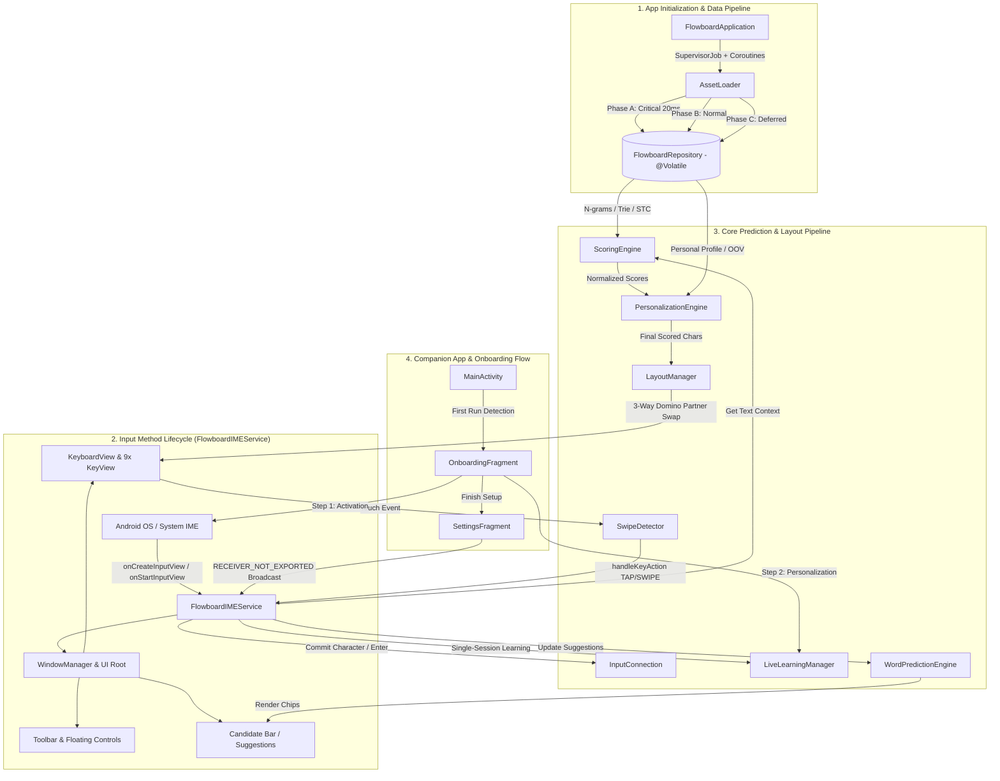
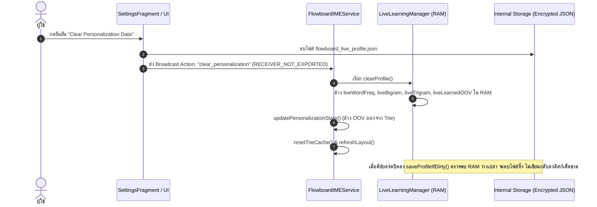

# 🏗️ Flowboard Android — System Architecture & Technical Documentation

เอกสารฉบับนี้จัดทำขึ้นสำหรับทีมนักพัฒนา (Developers, Software Engineers, และ System Architects) เพื่ออธิบายสถาปัตยกรรมโครงสร้างโค้ด วงรอบการทำงาน (Execution Lifecycle) รายชื่อฟังก์ชันหลักพร้อม Input/Output ระบบประมวลผล N-gram & Machine Learning รวมถึง **Impact Analysis Matrix (ตารางวิเคราะห์ผลกระทบ)** ที่ระบุอย่างชัดเจนว่า *หากมีการแก้ไขฟังก์ชันหรือคลาสใด จะส่งผลกระทบต่อเนื่องไปยังจุดใดบ้างในระบบ*

---

## 1. ภาพรวมสถาปัตยกรรมระบบ (System Architecture Overview)

Flowboard Android ถูกพอร์ตสถาปัตยกรรมระดับ 1:1 จาก **Prototype 22 (P22) Core** เป็นคีย์บอร์ด 9 ปุ่มที่ทำงานบนระบบ **Offline Prediction Engine 100%** โดยไม่มีการเชื่อมต่อเครือข่ายภายนอก และผ่านการ Hardening ความปลอดภัยระดับสูงสุด



---

## 2. โครงสร้างโปรเจกต์และหน้าที่ของไฟล์ (Project & Package Structure)

```text
app/src/main/
├── java/com/flowboard/ime/
│   ├── FlowboardApplication.kt            # Application Entry Point & 3-Phase Coroutine Asset Pipeline
│   ├── MainActivity.kt                    # Companion App Router, Status Poller, Navigation Chrome Controller
│   ├── data/
│   │   ├── AssetLoader.kt                 # Coroutine IO JSON Deserializer (Optional OOV parsing)
│   │   ├── FlowboardRepository.kt         # In-Memory RAM Singleton with @Volatile memory barriers
│   │   ├── ClipboardManagerHelper.kt      # Local Clipboard Storage (LRU 30 items, Pin support)
│   │   ├── EmojiRepository.kt             # 9-Category Emoji Store & Recent Emojis Manager
│   │   └── models/
│   │       ├── ClusteredWordBigram.kt     # Group-compressed Word Bigram / Trigram model
│   │       ├── EngineWeights.kt           # Weights for 7 Sub-engines across 6 Context States
│   │       ├── KeySlots.kt                # 5-directional character container (tap, up, left, right, down)
│   │       ├── MasterLayout.kt            # 36-char placement mapping (homeKey, defaultSlot)
│   │       ├── PersonalProfile.kt         # User-specific bigram, trigram, wordFreq, learnedOOV (Complete isEmpty check)
│   │       ├── Profile.kt                 # System typing rules (allow_echo, buffs, immunity)
│   │       └── TrieNode.kt                # Prefix Trie Node Data Structure (freq, endOfWord, children)
│   ├── engine/
│   │   ├── LanguageManager.kt             # Shift & CapsLock state machine (OFF / SHIFT_ONCE / CAPS_LOCK)
│   │   ├── LayoutManager.kt               # 3-Way Domino Partner Swap algorithm (36 slots mapping)
│   │   ├── LiveLearningManager.kt         # Real-time OOV learner, Capacity-Driven Aging, Atomic .tmp Swap
│   │   ├── PersonalizationEngine.kt       # Additive zero-degradation user scoring layer
│   │   ├── ProfileManager.kt              # Real Profile Switcher (DEFAULT vs CHAT mode with profile_chat.json)
│   │   ├── ScoringEngine.kt               # 6-State Contextual 7-Sub-Engine Fusion & Precomputed DECAY_POWERS
│   │   └── WordPredictionEngine.kt        # Candidate Autocomplete, Next-Word, Prefix resolution with size limiters
│   ├── service/
│   │   └── FlowboardIMEService.kt         # Hardened IME Service (No Leaks, IPC Security, Incognito & Sensitive Filters)
│   ├── testing/
│   │   └── BotTester.kt                   # Automated simulation harness with precompiled Regexes
│   ├── ui/
│   │   ├── EmojiAdapter.kt                # RecyclerView Adapter for Emoji Grid
│   │   ├── KeyView.kt                     # Canvas-rendered 9-grid key (Zero GC churn in onDraw)
│   │   ├── KeyboardView.kt                # Custom 3x3 ViewGroup managing 9 KeyViews
│   │   ├── SwipeDetector.kt               # 5-directional gesture recognition (TAP, UP, DOWN, LEFT, RIGHT)
│   │   ├── onboarding/
│   │   │   └── OnboardingFragment.kt      # 2-Step First-Launch Setup Wizard (Activation & Personalization)
│   │   └── settings/
│   │       ├── AboutFragment.kt           # App Information, Version, Security & Support Links
│   │       ├── AdvancedTuningFragment.kt  # Developer Mode Engine Tuner (Ratios, Layout, Weights)
│   │       ├── PersonalizationFragment.kt # Settings for Live Learning, OOV, Multipliers, Storage Info
│   │       ├── SettingsFragment.kt        # Master Settings UI & Live Activation Status Checker
│   │       ├── ShortcutsFragment.kt       # Quick Text Snippets Editor (Keys 1-9)
│   │       ├── SidebarSettingsFragment.kt # Left/Right-handed Docked & Floating Controls
│   │       └── ThemesFragment.kt          # Theme Selector UI (7 Curated Themes)
│   └── util/
│       ├── SoundHapticManager.kt          # SoundPool audio & Safe Amplitude Vibration Fallback
│       └── ThemeManager.kt                # Color palettes (7 Themes: Auto, Light, Dark, Ocean, Mint, Sunset, Sakura)
│
├── assets/
│   ├── en/                                # English Offline Models & Dictionaries
│   │   ├── unigram.json                   # Character Unigram frequencies
│   │   ├── unigram_start.json             # Start-of-word character probabilities
│   │   ├── bigram.json                    # Character Bigram transition matrix
│   │   ├── trigram.json                   # Character Trigram transition matrix
│   │   ├── trie_dict_compressed.json      # Main English Dictionary Trie (50,000+ words)
│   │   ├── trie_dict_oov.json             # Out-of-Vocabulary Base Trie
│   │   ├── clustered_word_bigram.json     # Word-level Bigram contextual transitions
│   │   ├── clustered_word_trigram_en.json # Word-level Trigram contextual transitions
│   │   ├── sentence_topic_clusters.json   # STC semantic topic clusters
│   │   ├── master_layout.json             # Default 36-char keyboard layout placement
│   │   ├── profile_chat.json              # Chat mode informal speech heuristics
│   │   ├── my_personal_profile.json       # Built-in seed personal profile
│   │   └── word_list.json                 # Vocabulary candidate list
│   └── shared/
│       ├── symbol_page_1.json             # Primary symbols & numbers layout
│       └── symbol_page_2.json             # Extended math & punctuation symbols layout
│
├── res/
│   ├── layout/
│   │   ├── activity_main.xml              # Main Companion App Container (CoordinatorLayout)
│   │   ├── fragment_about.xml             # About Screen (Version, Architecture, Security, Support)
│   │   ├── fragment_advanced_tuning.xml   # Advanced Engine Tuner (Ratios, Master Layout, State Weights)
│   │   ├── fragment_onboarding.xml        # 2-Step Fullscreen Setup Wizard with Insets Protection
│   │   ├── fragment_settings.xml          # Main Settings Dashboard
│   │   ├── fragment_personalization.xml   # Personalization & Privacy Settings
│   │   ├── fragment_themes.xml            # Theme Picker Gallery
│   │   ├── fragment_sidebar_settings.xml  # Handedness & Delete Key Ergonomics
│   │   ├── fragment_shortcuts.xml         # Text Snippets Editor
│   │   ├── keyboard_layout.xml            # Floating & Docked Keyboard Root View
│   │   ├── emoji_panel.xml                # Bottom Emoji Selector Panel
│   │   ├── text_editing_panel.xml         # Cursor & Text Selection D-pad
│   │   ├── theme_quick_panel.xml          # Quick Theme Switcher Popup
│   │   ├── undo_redo_panel.xml            # History Action Controls
│   │   └── voice_input_panel.xml          # Speech-to-Text Interface
│   └── xml/
│       ├── method.xml                     # IME Subtype with settingsActivity link
│       ├── data_extraction_rules.xml      # Android 12+ Zero-Cloud Leak Exclusion Rules
│       └── backup_rules.xml               # Android 6–11 Legacy Backup Exclusion Rules
│
app/src/test/java/com/flowboard/ime/       # Unit & Persona Simulation Benchmark Suite
├── engine/
│   └── ScoringEngineTest.kt               # 7-Sub-Engine Weighting & State Transitions Test
└── testing/
    ├── AdvancedTuningTest.kt              # Ratio Overrides, Layout & Weight Customization Test
    ├── BotTesterTest.kt                   # P22 Benchmark Tap Rate Simulation Test
    ├── PersonalizationLiveTest.kt         # Live Learning, OOV Ranking & Encryption Verification
    ├── HeavyUserPersonaSimulationTest.kt  # 5,000+ Words High-Capacity Stress Simulation
    ├── LongTermUserPersonaSimulationTest.kt # Multi-day Inactivity & Safe Zone Immunity Test
    ├── ShortMessagePersonaSimulationTest.kt # Light User (Few Words/Day) Zero Forgetting Test
    ├── WordPredictionEngineTest.kt        # Autocomplete, Next-Word & Prefix Resolution Test
    └── TestDataFactory.kt                 # Mock Engine & Repository Data Factory
```

---

## 3. แคตตาล็อกฟังก์ชันหลักแยกตามโมดูล (Comprehensive Function Catalog)

### 3.1 Data Layer (`data/`)

#### `AssetLoader.kt`
* `loadCriticalData(repo: FlowboardRepository): Unit` (suspend)
  * **Input:** `FlowboardRepository`
  * **Output:** โหลด `unigram`, `master_layout`, `symbol_page_1/2` และเรียก `repo.markReady()` (~20ms)
* `loadNormalData(repo: FlowboardRepository): Unit` (suspend)
  * **Input:** `FlowboardRepository`
  * **Output:** โหลด `bigram`, `trigram`, `trie_dict_compressed`, `word_list`, `clustered_word_bigram`, `unigram_start`, `profile_chat`
* `loadDeferredData(repo: FlowboardRepository): Unit` (suspend)
  * **Input:** `FlowboardRepository`
  * **Output:** โหลด `trie_dict_oov`, `clustered_word_trigram_en`, `sentence_topic_clusters`, `my_personal_profile` และเรียก `repo.markFullyLoaded()`
* `loadPersonalProfile(path: String): PersonalProfile`
  * **Input:** พาธ JSON ของ Profile
  * **Output:** แปลงข้อมูล `bigram`, `trigram`, `wordFreq` และ `learnedOOV` โดย `learnedOOV` เป็น Optional ไม่ทำลายข้อมูลอื่นหากฟิลด์นี้ไม่มีในไฟล์

#### `ClipboardManagerHelper.kt`
* `getItems(): List<ClipboardItem>`
  * **Output:** รายการข้อความในคลิปบอร์ดทั้งหมด เรียงตาม Pinned และ Timestamp
* `addClip(text: String): ClipboardItem?`
  * **Input:** ข้อความใหม่ `String` (ถูกกรองผ่าน Sensitive Check บน IME Service ก่อนเสมอ)
  * **Output:** เพิ่มข้อความเข้าประวัติ (จำกัดสูงสุด 30 รายการแบบ LRU โดยเก็บรายการ Pinned ไว้)

---

### 3.2 Core Prediction & Scoring Engine (`engine/`)

#### `ScoringEngine.kt`
* `calculateScores(text: String): Map<String, Double>`
  * **Input:** ข้อความก่อนเคอร์เซอร์ (`text`)
  * **Output:** Map คะแนนความน่าจะเป็นของตัวอักษร 26 ตัว (`a-z`)
* `evaluateBranch(branchRoot: TrieNode, totalWords: Int, isOOV: Boolean, decay: Double, maxDepth: Int): Double`
  * **Output:** ค้นหาคำยอดนิยมใน Trie โดยใช้ตารางความเร็วสูง `DECAY_POWERS_0_80` แทน `Math.pow`
* `isDoubleCharValid(text: String, lastChar: String): Boolean`
  * **Input:** ข้อความย้อนหลัง และตัวอักษรล่าสุด
  * **Output:** ตรวจสอบกฎการเบิ้ลตัวอักษรตามพจนานุกรมและประวัติการเรียนรู้ส่วนบุคคล

#### `ProfileManager.kt`
* `switchProfile(mode: ProfileMode): Unit`
  * **Input:** `ProfileMode.DEFAULT` หรือ `ProfileMode.CHAT`
  * **Output:** สลับ Profile การพิมพ์จริงระหว่าง Base Typing กับ Chat Typing (`profile_chat.json`) พร้อมอัปเดต `bonusDict`

#### `LiveLearningManager.kt`
* `writeProfileFile(file: File, content: String): Unit`
  * **Output:** ทำการเขียนข้อมูลเข้ารหัสลงไฟล์ชั่วคราว `${file.name}.tmp` แล้วทำ Atomic Swap ไปยังไฟล์จริง ป้องกันข้อมูลสูญหาย 100% หากเกิด Crash ระหว่างเขียน

---

### 3.3 Service & UI Layer (`service/`, `ui/`, `util/`)

#### `FlowboardIMEService.kt`
* `onFinishInputView(finishingInput: Boolean): Unit`
  * **Output:** บันทึกการเรียนรู้ประโยคและบันทึกโปรไฟล์ลงดิสก์แบบ Deduplicated Session (ทำงานครั้งเดียวต่อ 1 ประโยค ป้องกัน Triple Word Duplication)
* `isLearningAllowedForCurrentField(): Boolean`
  * **Output:** ตรวจสอบรหัสผ่าน และตรวจจับ `EditorInfo.IME_FLAG_NO_PERSONALIZED_LEARNING` (ปิดการจำคำในโหมด Incognito / Private Browsing 100%)
* `onDestroy(): Unit`
  * **Output:** ยกเลิกการลงทะเบียน `primaryClipListener` จาก `ClipboardManager` ป้องกัน Memory Leak

#### `KeyView.kt`
* `onDraw(canvas: Canvas): Unit`
  * **Output:** วาดปุ่มคีย์บอร์ดโดยใช้ `TALL_THAI_CHARS` ใน `companion object` กำจัดการสร้าง ArrayList ใหม่ในทุกเฟรม (Zero GC Churn)

#### `SoundHapticManager.kt`
* `performSwipeVibration(): Unit`
  * **Output:** สั่นแบบ Waveform บนอุปกรณ์ที่รองรับ Amplitude Control และ Fallback ไปใช้ OneShot อัตโนมัติบนอุปกรณ์ Android 8.0-9.0

---

## 4. ตารางวิเคราะห์ผลกระทบ (Impact Analysis Matrix)

| โมดูล / ฟังก์ชันเป้าหมาย | เรียกใช้โดย (Incoming Callers) | เรียกใช้อะไรต่อ (Outgoing Calls) | ผลกระทบหากมีการแก้ไข (Blast Radius / Side Effects) |
|---|---|---|---|
| **`FlowboardRepository`** (Singleton) | เกือบทุกไฟล์ในโปรเจกต์ | `StateFlow`, `@Volatile` | 🔴 **CRITICAL (ทั้งระบบ):** ควบคุมหน่วยความจำหลักข้ามเธรดอย่างปลอดภัย |
| **`FlowboardIMEService.onFinishInputView()`** | Android IME Lifecycle | `LiveLearningManager.recordWordTyped()`, `saveProfileIfDirty()` | 🔴 **CRITICAL:** จัดการการจำคำศัพท์แบบครั้งเดียวต่อประโยค ป้องกัน Triple Duplication |
| **`LiveLearningManager.writeProfileFile()`** | `saveProfileIfDirty()` | `EncryptedFile`, `.tmp` Atomic File Swap | 🔴 **CRITICAL:** การันตีความปลอดภัยของไฟล์โปรไฟล์ ป้องกัน Data Loss จาก Crash |
| **`FlowboardIMEService.onDestroy()`** | Android OS Lifecycle | `clipboardManager.removePrimaryClipChangedListener()` | 🔴 **CRITICAL:** ป้องกัน Memory Leak ระดับ System Service |
| **`FlowboardIMEService.isLearningAllowedForCurrentField()`** | `onFinishInputView()`, `recordWordTyped()` | `IME_FLAG_NO_PERSONALIZED_LEARNING`, Password Check | 🟠 **HIGH (Privacy):** ปกป้องความเป็นส่วนตัวในโหมด Incognito / Private Browsing |

---

## 5. สถาปัตยกรรม Capacity-Driven Watermark Forgetting & High-Frequency Protection

```
                  ┌─────────────────────────────────────────────────────────┐
                  │              Total Capacity: 1,000 Words                │
                  └─────────────────────────────────────────────────────────┘
                                               ▲
                                               │
   [ 0% - 84% Capacity ] ──────────────────────┼──► SAFE ZONE: 0% Decay (ห้ามลืมเด็ดขาด)
   (คำศัพท์ไม่ถึง 850 คำ)                        │   Light users / Inactive periods ปลอดภัย 100%
                                               │
   [ ≥ 85% High Watermark ] ───────────────────┼──► HIGH WATERMARK TRIGGER: เริ่มเปิด Decay
   (คำศัพท์แตะ 850 คำขึ้นไป)                     │   - Prune เฉพาะคำ Typo / ขยะที่พิมพ์ครั้งเดียว (< 1.0)
                                               │   - คำที่พิมพ์ ≥ 3 ครั้ง ได้รับ Floor Protection (ไม่ตกเป็น 0)
                                               │
   [ Decay Runs Every 500 Words Typed ] ───────┴──► รอบการคำนวณตรวจสอบ (WORDS_BETWEEN_DECAY_CHECK)
```

$$\text{isCapacityPressureHigh}() = (\text{liveWordFreq.size} \ge 850) \lor (\text{liveBigram.size} \ge 1700)$$

$$\text{newCount} = \begin{cases} 
\text{count} & \text{ถ้า } \text{isCapacityPressureHigh}() = \text{false} \text{ (Safe Zone)} \\
\max(1, \text{round}(\text{count} \times 0.95)) & \text{ถ้า } \text{count} \ge 3 \text{ (High-Frequency Immunity Floor)} \\
\text{round}(\text{count} \times 0.95) & \text{ถ้า } \text{decayed} \ge 1.0 \\
0 \text{ (Pruned from Memory \& Disk)} & \text{ถ้า } \text{decayed} < 1.0 \text{ (Typo Elimination)}
\end{cases}$$

---

## 6. การแก้ไขบั๊กล้างข้อมูลส่วนบุคคล (Ghost Profile Resurrection Bug Fix)



---

## 7. ค่าเริ่มต้นของระบบและกระบวนการ Onboarding (Factory Defaults & Onboarding Flow)

| การตั้งค่า (Feature) | ค่าเริ่มต้น (Default) | คีย์ SharedPreferences & ชนิดข้อมูล | พฤติกรรมการทำงาน |
|---|---|---|---|
| **ขนาดคีย์บอร์ด (Height)** | **Small** | `docked_keyboard_scale = 1.0f` (Float) | ปรับความสูงแป้นพิมพ์กะทัดรัด เหมาะกับการพิมพ์มือเดียว |
| **ธีมคีย์บอร์ด (Theme)** | **Auto** | `active_theme = "System default"` (String) | ปรับเปลี่ยนสีตามโหมด Light/Dark ของระบบ Android อัตโนมัติ |
| **ตำแหน่งแถบเครื่องมือ (Sidebar)** | **ชิดซ้าย (Left)** | `docked_side_tools_left = true` (Boolean) | วางแถบเครื่องมือ (อิโมจิ, คลิปบอร์ด, ตั้งค่า) ไว้ฝั่งซ้ายของแป้น |
| **ตำแหน่งปุ่มลบ (Delete Button)** | **ชิดขวา (Right)** | `delete_btn_follow_side_tools = false`<br/>`delete_btn_fixed_side = "right"` | ตรึงปุ่ม Backspace ไว้ฝั่งขวาเสมอ |
| **เสียงกดปุ่ม (Sound on keypress)** | **เปิด (ON)** | `sound_on_keypress = true` (Boolean) | เล่นเสียงคีย์บอร์ดตอบสนองทุกการสัมัส |
| **การสั่นสัมผัส (Vibration)** | **เปิด (ON)** | `vibration_on_keypress = true` (Boolean) | สั่น Haptic Feedback ทุกการแตะและสไวป์ |
| **การปรับแต่งส่วนบุคคล (Personalization)** | **เปิด (Recommended)** | `personalization_enabled = true` (Boolean) | จดจำคำศัพท์และคู่คำแบบเข้ารหัสในเครื่อง 100% |

---

## 8. สถาปัตยกรรมความปลอดภัยและการเข้ารหัส (Security & Encryption Policy)

1. **100% Offline IME (Zero Internet Permission)**: ลบ `<uses-permission android:name="android.permission.INTERNET" />` ออกจาก Manifest รับประกัน 100% Offline
2. **IPC Isolation**: Settings Broadcast Receiver ใช้ `RECEIVER_NOT_EXPORTED` ป้องกันแอปอื่นแทรกแซงหรือสั่งล้างข้อมูล
3. **Incognito & Sensitive Data Immunity**: ตรวจจับ `IME_FLAG_NO_PERSONALIZED_LEARNING` และ `ClipDescription.EXTRA_IS_SENSITIVE` ไม่ให้บันทึกคำค้นหาส่วนตัวหรือรหัสผ่านลงเครื่อง
4. **Hardware-Backed AES-256 GCM Atomic Encryption**: เข้ารหัส `flowboard_live_profile.json` ภายใต้ Android Keystore พร้อม Atomic `.tmp` Swap
5. **Zero Cloud Backup Leakage**: ปิดการสำรองข้อมูลขึ้น Google Drive ผ่าน `data_extraction_rules.xml` และ `backup_rules.xml`
