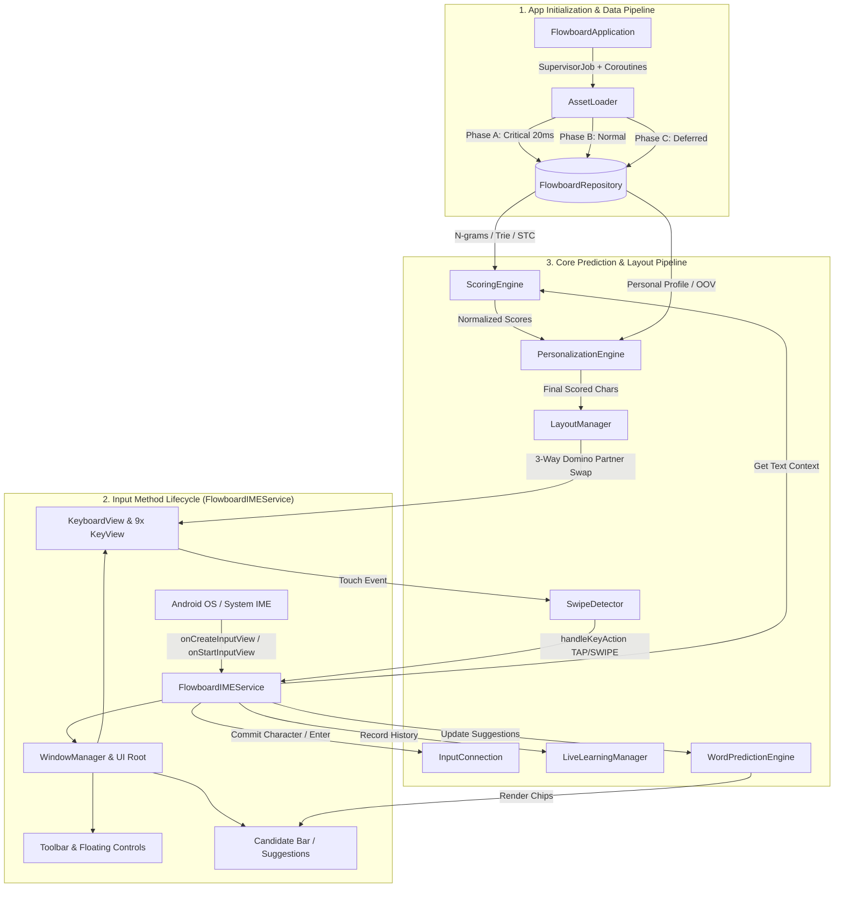

# 🏗️ Flowboard Android — System Architecture & Technical Documentation

เอกสารฉบับนี้จัดทำขึ้นสำหรับทีมนักพัฒนา (Developers, Software Engineers, และ System Architects) เพื่ออธิบายสถาปัตยกรรมโครงสร้างโค้ด วงรอบการทำงาน (Execution Lifecycle) รายชื่อฟังก์ชันหลักพร้อม Input/Output ระบบประมวลผล N-gram & Machine Learning รวมถึง **Impact Analysis Matrix (ตารางวิเคราะห์ผลกระทบ)** ที่ระบุอย่างชัดเจนว่า *หากมีการแก้ไขฟังก์ชันหรือคลาสใด จะส่งผลกระทบต่อเนื่องไปยังจุดใดบ้างในระบบ*

---

## 1. ภาพรวมสถาปัตยกรรมระบบ (System Architecture Overview)

Flowboard Android ถูกพอร์ตสถาปัตยกรรมระดับ 1:1 จาก **Prototype 22 (P22) Core** เป็นคีย์บอร์ด 9 ปุ่มที่ทำงานบนระบบ **Offline Prediction Engine 100%** โดยไม่มีการเชื่อมต่อเครือข่ายภายนอก



---

## 2. โครงสร้างโปรเจกต์และหน้าที่ของไฟล์ (Project & Package Structure)

```text
app/src/main/java/com/flowboard/ime/
├── FlowboardApplication.kt        # Application Entry Point & 3-Phase Asset Loading Pipeline
├── MainActivity.kt                # Companion Settings App, IME Activation, Runtime Permissions
├── data/
│   ├── AssetLoader.kt             # Coroutine IO JSON Deserializer & Trie Parsers
│   ├── FlowboardRepository.kt     # In-Memory RAM State Singleton (Single Source of Truth)
│   ├── ClipboardManagerHelper.kt  # Local Clipboard Storage (SharedPreferences JSON, Max 30 items)
│   ├── EmojiRepository.kt         # 9-Category Emoji Store & Recent Emojis Manager
│   └── models/
│       ├── ClusteredWordBigram.kt # Group-compressed Word Bigram / Trigram model
│       ├── EngineWeights.kt       # Weights for 7 Sub-engines across 6 Context States
│       ├── KeySlots.kt            # 5-directional character container (tap, up, left, right, down)
│       ├── MasterLayout.kt        # Character placement mapping (homeKey, defaultSlot)
│       ├── PersonalProfile.kt     # User-specific bigram, trigram, wordFreq, learnedOOV
│       ├── Profile.kt             # System typing rules (allow_echo, buffs, immunity)
│       └── TrieNode.kt            # Trie Node Data Structure (frequency, isEndOfWord, children)
├── engine/
│   ├── LanguageManager.kt         # Shift & CapsLock state machine (OFF / SHIFT_ONCE / CAPS_LOCK)
│   ├── LayoutManager.kt           # 3-Way Domino Partner Swap algorithm (36 slots mapping)
│   ├── LiveLearningManager.kt     # Real-time OOV learner, Aging Decay (0.95x), JSON persistence
│   ├── PersonalizationEngine.kt   # Additive zero-degradation user scoring layer
│   ├── ProfileManager.kt          # Profile mode manager (Default vs Chat)
│   ├── ScoringEngine.kt           # 6-State Contextual 7-Sub-Engine Weighted Fusion
│   └── WordPredictionEngine.kt    # Autocomplete, Next-Word, Prefix resolution, Stop-word filtering
├── service/
│   └── FlowboardIMEService.kt     # Main Android InputMethodService (Window, Touch, Event Loop)
├── testing/
│   └── BotTester.kt               # Automated simulation & benchmark harness (Tap Rate testing)
├── ui/
│   ├── EmojiAdapter.kt            # RecyclerView Adapter for Emoji Grid
│   ├── KeyView.kt                 # Custom Canvas-rendered View for single 9-grid key
│   ├── KeyboardView.kt            # Custom 3x3 ViewGroup managing 9 KeyViews
│   ├── SwipeDetector.kt           # 5-directional gesture recognition (TAP, UP, DOWN, LEFT, RIGHT)
│   └── settings/
│       ├── PersonalizationFragment.kt # Settings for Live Learning, OOV, Multipliers
│       ├── SettingsFragment.kt        # Master Settings UI & Activation Status Checker
│       ├── ShortcutsFragment.kt       # Quick Text Snippets Editor (Keys 1-9)
│       ├── SidebarSettingsFragment.kt # Left/Right-handed Docked & Floating Controls
│       └── ThemesFragment.kt          # Theme Selector UI (7 Curated Themes)
└── util/
    ├── SoundHapticManager.kt      # SoundPool audio & Vibrator/VibrationEffect haptics
    └── ThemeManager.kt            # Color palettes (7 Themes: Auto, Light, Dark, Ocean Blue, Mint Teal, Sunset Coral, Sakura Bloom)

app/src/main/res/xml/
├── method.xml                     # IME Service subtype configuration
├── data_extraction_rules.xml      # Android 12+ Cloud Backup & Device Transfer Zero-Leak Rules
└── backup_rules.xml               # Android 6–11 Legacy Full Backup Exclusion Rules
```

---

## 3. แคตตาล็อกฟังก์ชันหลักแยกตามโมดูล (Comprehensive Function Catalog)

### 3.1 Data Layer (`data/`)

#### `AssetLoader.kt`
* `loadCriticalData(repo: FlowboardRepository): Unit` (suspend)
  * **Input:** `FlowboardRepository`
  * **Output:** โหลด `unigram`, `master_layout`, `symbol_page_1/2` และเรียก `repo.markReady()` (~20ms)
* `loadNormalData(repo: FlowboardRepository): Unit` (suspend)
  * **Input:** `FlowboardRepository`
  * **Output:** โหลด `bigram`, `trigram`, `trie_dict_compressed`, `word_list`, `clustered_word_bigram`, `unigram_start`, `profile_chat`
* `loadDeferredData(repo: FlowboardRepository): Unit` (suspend)
  * **Input:** `FlowboardRepository`
  * **Output:** โหลด `trie_dict_oov`, `clustered_word_trigram_en`, `sentence_topic_clusters`, `my_personal_profile` และเรียก `repo.markFullyLoaded()`
* `updatePersonalizationState(ctx: Context, repo: FlowboardRepository): Unit`
  * **Input:** Android `Context`, `FlowboardRepository`
  * **Output:** อ่านค่า SharedPreferences ของ Personalization และ Inject Learned OOV เข้า `trieDictOOV`

#### `ClipboardManagerHelper.kt`
* `getItems(): List<ClipboardItem>`
  * **Output:** รายการข้อความในคลิปบอร์ดทั้งหมด เรียงตาม Pinned และ Timestamp
* `addClip(text: String): ClipboardItem?`
  * **Input:** ข้อความใหม่ `String`
  * **Output:** เพิ่มข้อความเข้าประวัติ (จำกัดสูงสุด 30 รายการแบบ LRU โดยเก็บรายการ Pinned ไว้)
* `togglePin(id: String): Boolean`
  * **Input:** ID ของคลิปบอร์ด
  * **Output:** สลับสถานะ Pin/Unpin และจัดเรียงรายการใหม่
* `clearUnpinned(): Unit`
  * **Output:** ลบข้อความที่ไม่ได้ปักหมุดทั้งหมด

#### `EmojiRepository.kt`
* `getEmojisForCategory(context: Context, category: EmojiCategory): List<String>`
  * **Input:** `EmojiCategory` (RECENT, SMILEYS, PEOPLE, ANIMALS, FOOD, TRAVEL, ACTIVITIES, OBJECTS, FLAGS)
  * **Output:** รายชื่ออีโมจิในหมวดหมู่นั้นๆ
* `addRecentEmoji(context: Context, emoji: String): Unit`
  * **Input:** อีโมจิที่ถูกเลือก
  * **Output:** บันทึกลง SharedPreferences ในหมวด RECENT (สูงสุด 40 ตัว)

---

### 3.2 Core Prediction & Scoring Engine (`engine/`)

#### `ScoringEngine.kt`
* `calculateScores(text: String): Map<String, Double>`
  * **Input:** ข้อความก่อนเคอร์เซอร์ (`text`)
  * **Output:** Map ของคะแนนความน่าจะเป็นของตัวอักษร 26 ตัว (`a-z`) และสัญลักษณ์ที่รองรับ
  * **Logic:**
    1. ตรวจสอบ Context State (1, 2, 3, 4, 7, 8)
    2. คำนวณคะแนนจาก 7 Sub-engines (U, B, T, D, WB, WT, STC)
    3. ตรวจจับ OOV Decay (หากไม่มีคำใน Trie ให้โอนน้ำหนัก D $\rightarrow$ T)
    4. หลอมรวมคะแนนถ่วงน้ำหนัก (Weighted Score Fusion)
    5. ปรับแต่งด้วย Echo Booster, Bonus Dict, และ Unigram Tiebreaker
    6. ส่งต่อให้ `PersonalizationEngine` บวกคะแนนส่วนบุคคล (Additive Layer)
* `resetTrieCache(): Unit`
  * **Output:** ล้างแคช Trie Node สำหรับการเริ่มประโยคใหม่
* `isDoubleCharValid(text: String, lastChar: String): Boolean`
  * **Input:** ข้อความย้อนหลัง และตัวอักษรล่าสุด
  * **Output:** `Boolean` ระบุว่าตัวอักษรนี้สามารถพิมพ์ซ้ำ (Sticky Key) ได้หรือไม่ตามกฎภาษาอังกฤษ

#### `LayoutManager.kt`
* `assignLayout(scores: Map<String, Double>): Map<String, KeySlots>`
  * **Input:** Map คะแนนตัวอักษรจาก `ScoringEngine`
  * **Output:** ผัง 9 ปุ่ม (`key_1` ถึง `key_9`) พร้อมตัวอักษรประจำ 5 ตำแหน่ง (`tap`, `up`, `left`, `right`, `down`)
  * **Logic:**
    1. `buildBaseLayout()`: จัดวางตัวอักษรลง Home Key ตาม Master Layout โดยใช้ `LAZY_TAP_RATIO = 1.15`
    2. `partnerSwapEN()`: สลับตัวอักษรรองข้ามปุ่มคู่หูแบบ 3-Way Domino Partner Swap
    3. `fillUnrenderedChars()`: เกลี่ยตัวอักษรที่เหลือให้ครบ 36 ช่อง

#### `WordPredictionEngine.kt`
* `getActivePrefix(fullText: String): String`
  * **Input:** ข้อความก่อนหน้าเคอร์เซอร์ (`fullText`)
  * **Output:** คืนค่า `""` หากอยู่ในโหมด Next-Word (หลังเว้นวรรค/เครื่องหมายวรรคตอน) หรือคืนค่าตัวอักษรท้ายคำที่กำลังพิมพ์ (Prefix Completion Mode เช่น `"mor"`, `"john@"`)
* `getPredictions(fullText: String, maxCount: Int = 3): List<String>`
  * **Input:** ข้อความก่อนเคอร์เซอร์ และจำนวนคำที่ต้องการ (default 3)
  * **Output:** รายการคำแนะนำ 3 คำที่สอดคล้องกับบริบทและ Casing (พิมพ์เล็ก/ใหญ่)
  * **Logic:**
    * **Next-Word Mode (หลัง Space):** ใช้ Trigram $\rightarrow$ Bigram $\rightarrow$ STC โดยจำกัด Stop Connectors (the, a, in, to) ไม่เกิน 1 คำ
    * **Prefix Autocomplete Mode (ขณะพิมพ์):** ค้นหาจาก Trie + Context Boost + Grammar Plural/Singular Boost - Length Penalty

#### `PersonalizationEngine.kt`
* `applyPersonalization(finalScores: HashMap<String, Double>, activeWordsArray: List<String>, activePrefix: String, state: Int): Unit`
  * **Input:** Map คะแนนเดิม, รายการคำก่อนหน้า, Prefix ปัจจุบัน, State ปัจจุบัน
  * **Output:** แก้ไข `finalScores` ในหน่วยความจำโดยตรงแบบ Additive (+Logarithmic Bonus)
  * **Rules:**
    * คำคู่ Bigram/Trigram ส่วนบุคคล
    * Uncertain Gap Boosting เมื่อคะแนน Top 2 สูสีกัน ($\Delta_{gap} < 15.0$)
    * ห้ามให้คะแนนแก่ตัวเลข (0-9) เด็ดขาด

#### `LiveLearningManager.kt`
* `recordWordTyped(fullText: String): Unit`
  * **Input:** ประโยคหรือข้อความที่พิมพ์
  * **Output:** ดักจับคำศัพท์ใหม่ อีเมล อัปเดต Bigram/Trigram ใน RAM และ Inject เข้า `trieDictOOV` ทันที
* `applyAgingDecay(decayFactor: Double = 0.95): Unit`
  * **Input:** Factor การลดทอน (default 0.95)
  * **Output:** ลดความถี่ของคำเก่าทุกๆ 500 คำ และลบคำที่แตะ 0 ออกจาก Profile
* `saveProfileIfDirty(): Unit`
  * **Output:** บันทึก In-Memory Profile ลงไฟล์ `flowboard_live_profile.json` บน Internal Storage เมื่อคีย์บอร์ดปิด

#### `LanguageManager.kt`
* `cycleShift(): ShiftState`
  * **Output:** สลับสถานะ `OFF` $\rightarrow$ `SHIFT_ONCE` $\rightarrow$ `CAPS_LOCK` (หากกดซ้ำภายใน 800ms) $\rightarrow$ `OFF`
* `applyCase(char: String): String`
  * **Input:** ตัวอักษรที่พิมพ์
  * **Output:** แปลงตัวพิมพ์เล็ก/ใหญ่ และรีเซ็ต `SHIFT_ONCE` กลับเป็น `OFF` อัตโนมัติ

---

### 3.3 Service & UI Layer (`service/`, `ui/`, `util/`)

#### `FlowboardIMEService.kt`
* `onCreateInputView(): View`
  * **Output:** สร้าง Root View ของคีย์บอร์ด ผูก Event Listeners และสร้าง Sub-panels (Clipboard, Emoji, Resize, Quick Themes)
* `handleKeyAction(action: SwipeDetector.SwipeAction, keySlots: KeySlots, keyIndex: Int): Unit`
  * **Input:** แอ็กชันการสัมผัส (TAP, UP, DOWN, LEFT, RIGHT), ข้อมูลปุ่ม, หมายเลขปุ่ม (1-9)
  * **Output:** ส่งอักขระไปยัง `InputConnection`, เล่นเสียง/สั่น, เรียก `ScoringEngine` คำนวณคะแนนใหม่ และอัปเดต UI
* `usePrediction(textView: TextView): Unit`
  * **Input:** `TextView` ของชิปคำแนะนำที่ผู้ใช้แตะเลือกจาก Candidate bar
  * **Output:** ตรวจสอบ `activePrefix` เพื่อลบเฉพาะส่วนที่กำลังพิมพ์ค้างไว้ (หากเคอร์เซอร์อยู่หลัง Space จะไม่ลบคำเดิม) แล้วพิมพ์คำทำนายเต็มพร้อมเว้นวรรคอัตโนมัติ
* `handleSend(): Unit`
  * **Output:** ตัดสินใจบริบทของปุ่ม Enter/Action (Gboard-grade resolution) ส่ง Action (Search, Send, Go, Next, Done) หรือเคาะขึ้นบรรทัดใหม่ `\n` ตามประเภท `EditorInfo`
* `isEnterActionApplicable(info: EditorInfo?): Boolean`
  * **Input:** `EditorInfo` ของช่องกรอกข้อความปัจจุบัน
  * **Output:** `Boolean` ระบุว่าเป็นช่อง Action หรือช่องข้อความหลายบรรทัด (Multiline / Notes / Gemini / Chat Prompt) ที่ต้องเคาะขึ้นบรรทัดใหม่
* `toggleFloatingMode(): Unit`
  * **Output:** สลับระหว่าง Docked Mode (เกาะขอบล่าง) กับ Floating Mode (หน้าต่างลอยเลื่อนได้)
* `setHandedness(isLeftHanded: Boolean): Unit`
  * **Input:** `true` = มือซ้าย, `false` = มือขวา
  * **Output:** ย้ายตำแหน่งแถบเครื่องมือและปุ่มลบไปไว้ฝั่งซ้ายหรือขวาตามต้องการ

#### `KeyboardView.kt` & `KeyView.kt`
* `KeyboardView.updateLayout(layout: Map<String, KeySlots>): Unit`
  * **Input:** Map ผังปุ่ม 9 ปุ่ม
  * **Output:** ส่งต่อข้อมูลให้ `KeyView[0..8].bind(slots)` เพื่อวาด Canvas ใหม่
* `KeyView.onDraw(canvas: Canvas): Unit`
  * **Output:** วาดพื้นหลัง Zone Gradient (TOP/MID/BOT), เงา 2dp, ตัวอักษรหลักตรงกลาง (Tap) และตัวอักษรย่อย 4 ทิศทาง

#### `SwipeDetector.kt`
* `onTouchEvent(event: MotionEvent): Boolean`
  * **Input:** MotionEvent จาก Android Touch System
  * **Output:** คำนวณระยะเวกเตอร์ $(dx, dy)$ เทียบ `thresholdPx = 25dp` เพื่อส่งผลลัพธ์เป็น `SwipeAction` (TAP, UP, DOWN, LEFT, RIGHT)

#### `SoundHapticManager.kt`
* `playTap() / playSwipe(): Unit`
  * **Output:** เล่นเสียงคีย์บอร์ดผ่าน `SoundPool` และสั่งสั่นฮัปติกผ่าน `Vibrator` / `VibrationEffect`

#### `ThemeManager.kt`
* `getThemeColors(context: Context, themeName: String, isSystemDark: Boolean): ThemeColors`
  * **Input:** ชื่อธีม (7 ธีม: `System default`, `Light`, `Dark`, `Ocean Blue`, `Mint Teal`, `Sunset Coral`, `Sakura Bloom`) และสถานะ Dark Mode ของระบบ
  * **Output:** Object `ThemeColors` ที่ประกอบด้วยสีพื้นหลัง, สีกด, สีตัวอักษร, สี Accent และสี Zone Gradient

---

## 4. ตารางวิเคราะห์ผลกระทบ (Impact Analysis Matrix)

> [!IMPORTANT]
> ตารางนี้ระบุความเชื่อมโยงระดับฟังก์ชัน/คลาส เพื่อให้ประเมินความเสี่ยงและผลกระทบข้างเคียง (Blast Radius) ก่อนลงมือแก้ไขโค้ด

| โมดูล / ฟังก์ชันเป้าหมาย | เรียกใช้โดย (Incoming Callers) | เรียกใช้อะไรต่อ (Outgoing Calls) | ผลกระทบหากมีการแก้ไข (Blast Radius / Side Effects) |
|---|---|---|---|
| **`FlowboardRepository`** (Singleton) | เกือบทุกไฟล์ในโปรเจกต์ (`AssetLoader`, `ScoringEngine`, `LayoutManager`, `FlowboardIMEService`) | `StateFlow` | 🔴 **CRITICAL (ทั้งระบบ):** หากโครงสร้าง State หรือตัวแปรเปลี่ยน จะกระทบ Data Pipeline, การคำนวณคะแนน, ผังคีย์บอร์ด และทำให้ Test ทั้งหมดล้มเหลว |
| **`AssetLoader.loadCriticalData()`** | `FlowboardApplication.onCreate()` | `FlowboardRepository.markReady()` | 🔴 **CRITICAL:** กระทบ Cold start time ของคีย์บอร์ด หากโหลดช้าหรือพัง คีย์บอร์ดจะไม่สามารถ Render ได้ (ติดหน้าจอว่าง) |
| **`AssetLoader.loadNormalData()`** | `FlowboardApplication.onCreate()` | `FlowboardRepository.bigram`, `trieDict`, `wordList` | 🟠 **HIGH:** หาก Format JSON เปลี่ยนหรือเกิด Exception ระบบ Dictionary & Autocomplete จะไม่ทำงาน (ถอยไปใช้ Unigram fallback) |
| **`ScoringEngine.calculateScores()`** | `FlowboardIMEService.refreshLayout()`, `BotTester.runTest()` | `getUnigramScores()`, `getDictScores()`, `PersonalizationEngine` | 🔴 **CRITICAL:** กำหนดความแม่นยำของตัวอักษรทั้งหมด หากแก้ตรรกะนี้ Tap Rate ของคีย์บอร์ดจะเปลี่ยนทันที กระทบ `BotTester` Benchmark |
| **`ScoringEngine.getDictScores()`** | `ScoringEngine.calculateScores()` | `TrieNode.get()`, `FlowboardRepository.trieDict` | 🟠 **HIGH:** กระทบการทำนายคำใน State 2, 3, 4 (Prefix search) และ OOV Fallback logic |
| **`LayoutManager.assignLayout()`** | `FlowboardIMEService.refreshLayout()`, `BotTester.runTest()` | `buildBaseLayout()`, `partnerSwapEN()`, `fillUnrenderedChars()` | 🔴 **CRITICAL:** จัดการผัง 9 ปุ่ม หากแก้ผิดพลาด ตัวอักษรอาจหายไปจากแป้น, เกิดการทับซ้อน (Duplicate char), หรือ Domino Swap ทำงานผิดทิศทาง |
| **`LayoutManager.partnerSwapEN()`** | `LayoutManager.assignLayout()` | `PARTNER_KEY`, `LAZY_TAP_RATIO` | 🟡 **MEDIUM:** กระทบการสลับตัวอักษรระหว่างปุ่มคู่หู (Key 1↔2, 3↔6, 4↔7, 8↔9) หากแก้ผิด ตัว Tap อาจสลับตำแหน่งมั่ว |
| **`WordPredictionEngine.getPredictions()`** | `FlowboardIMEService.updatePredictions()` | `getActivePrefix()`, `predictNextWords()`, `autocompletePrefix()` | 🟠 **HIGH:** กระทบแถบ Candidate bar ด้านบนคีย์บอร์ด หากแก้เกณฑ์การกรอง Stop-word หรือ N-gram อาจทำให้คำแนะนำไม่ตรงบริบท |
| **`WordPredictionEngine.getActivePrefix()`** | `WordPredictionEngine.getPredictions()`, `FlowboardIMEService.usePrediction()` | `EMAIL_TAIL_REGEX`, `WORD_TOKEN_REGEX` | 🟠 **HIGH:** แยกแยะระหว่าง Next-Word Mode กับ Prefix Completion Mode หากผิดพลาดจะทำให้การลบคำก่อนหน้าหรือการแทนที่คำพัง |
| **`PersonalizationEngine.applyPersonalization()`** | `ScoringEngine.calculateScores()` | `PersonalProfile`, `countToTrigramBonus()`, `countToBigramBonus()` | 🟡 **MEDIUM:** ปรับคะแนนโบนัสส่วนบุคคล หากแก้สูตร Logarithmic อาจทำให้คำส่วนบุคคลกลบคำมาตรฐาน หรือไม่แสดงผล |
| **`LiveLearningManager.recordWordTyped()`** | `FlowboardIMEService.handleSpace()`, `handleKeyAction()`, `usePrediction()` | `injectOOVWordToTrie()`, `updateRepositoryProfile()`, `pruneIfExceeded()` | 🟡 **MEDIUM:** กระทบการเรียนรู้คำใหม่อัตโนมัติ หาก Regex หรือเงื่อนไขพัง ระบบจะไม่จำคำศัพท์ใหม่และอีเมล |
| **`LiveLearningManager.applyAgingDecay()`** | `LiveLearningManager.recordWordTyped()`, `loadProfile()` | `liveWordFreq`, `liveBigram`, `liveTrigram` | 🟢 **LOW-MEDIUM:** ควบคุมการลืมคำเก่า หาก Factor ผิด คำที่ผู้ใช้พิมพ์บ่อยอาจถูกลบเร็วเกินไป |
| **`LanguageManager.cycleShift()`** | `FlowboardIMEService.handleShift()` | `ShiftState` (`OFF` $\rightarrow$ `SHIFT_ONCE` $\rightarrow$ `CAPS_LOCK`) | 🟢 **LOW:** กระทบปุ่ม Shift และการแปลงตัวพิมพ์เล็ก/ใหญ่ |
| **`KeyboardView.updateLayout()`** | `FlowboardIMEService.refreshLayout()` | `KeyView.bind()` (วน Loop 9 ปุ่ม) | 🟠 **HIGH:** กระทบการ Render ปุ่มบนหน้าจอ หาก Bind ข้อมูลไม่ครบ ตัวอักษรบนปุ่มจะไม่เปลี่ยนตาม State |
| **`KeyView.onDraw()`** | Android UI Rendering Pipeline | `Canvas.drawRoundRect()`, `Canvas.drawText()`, `Paint` | 🟡 **MEDIUM:** กระทบความสวยงาม ประสิทธิภาพ GPU/FPS และตำแหน่งตัวอักษร 5 ทิศทางบนแต่ละปุ่ม |
| **`SwipeDetector.onTouchEvent()`** | `KeyView.dispatchTouchEvent()` | `onAction(SwipeAction)` | 🟠 **HIGH:** กระทบความแม่นยำในการตรวจจับทิศทางการปัด (Gesture Threshold 25dp) หากปรับผิด ผู้ใช้อาจปัดติดยากหรือกลายเป็น Tap บ่อยเกินไป |
| **`FlowboardIMEService.handleKeyAction()`** | `KeyView` Touch Listener via `SwipeDetector` | `InputConnection.commitText()`, `refreshLayout()`, `updatePredictions()` | 🔴 **CRITICAL:** จุดเชื่อมต่อหลักระหว่างการพิมพ์กับ Android OS หากมี Bug จะทำให้ตัวอักษรไม่ถูกส่งเข้าแอปเป้าหมาย |
| **`FlowboardIMEService.usePrediction()`** | Candidate Bar suggestion chips click | `getActivePrefix()`, `InputConnection.deleteSurroundingText()`, `commitText()` | 🟠 **HIGH:** แทนที่คำแนะนำที่ผู้ใช้เลือก โดยลบเฉพาะ active prefix และเว้นวรรคอัตโนมัติ |
| **`FlowboardIMEService.handleSend() / isEnterActionApplicable()`** | Enter/Send key click on keyboard | `performEditorAction()`, `sendNewline()` | 🟠 **HIGH:** ควบคุมพฤติกรรมปุ่ม Enter ในทุกแอป (ป้องกันบัคปิดคีย์บอร์ดใน Gemini/Notes) |
| **`FlowboardIMEService.toggleFloatingMode()`** | Toolbar Floating Button, Settings | `WindowManager.updateViewLayout()`, `layoutInflater` | 🟡 **MEDIUM:** สลับโหมด Docked $\leftrightarrow$ Floating หากแก้ผิด Window Flags หรือ LayoutParams อาจทำให้คีย์บอร์ดลอยหลุดขอบจอหรือค้าง |
| **`ThemeManager.getThemeColors()`** | `FlowboardIMEService.applySettingsAndTheme()`, `KeyView.refreshTheme()` | `ThemeColors`, `toColorInt()` | 🟢 **LOW:** จัดการเฉดสีทั้ง 7 ธีมของคีย์บอร์ดและไอคอน |
| **`SoundHapticManager.playTap() / playSwipe()`** | `FlowboardIMEService.handleKeyAction()` | `SoundPool.play()`, `Vibrator.vibrate()` | 🟢 **LOW:** กระทบเสียงและระบบสั่นตอบสนอง |
| **`BotTester.runTest()`** | Unit Tests (`BotTesterTest.kt`) | `ScoringEngine`, `LayoutManager`, `FlowboardRepository` | 🟢 **LOW (Testing Only):** ไม่มีผลต่อการใช้งานจริงของผู้ใช้ แต่ใช้ประเมินคุณภาพและป้องกัน Regression ของ Tap Rate |

---

## 5. วงรอบการทำงานเมื่อเกิดการกด 1 ตัวอักษร (Single Keystroke Event Loop)

ลำดับการเรียกฟังก์ชัน (Call Hierarchy) จากการสัมผัสหน้าจอ 1 ครั้ง จนถึงการส่งตัวอักษรเข้า OS:

```text
1. User Touch Down/Move/Up บน KeyView
   └─► SwipeDetector.onTouchEvent(event)
       └─► คำนวณเวกเตอร์ระยะทาง (dx, dy) เทียบ thresholdPx (25dp)
           └─► SwipeDetector.onAction(TAP / UP / DOWN / LEFT / RIGHT)
               └─► FlowboardIMEService.handleKeyAction(action, keySlots, keyIndex)
                   ├─► SoundHapticManager.playTap() / playSwipe()
                   ├─► ดึงตัวอักษรเป้าหมายจาก keySlots (เช่น slot 'tap' -> "h")
                   ├─► LanguageManager.applyCase("h") -> "H" (หากเปิด Shift)
                   ├─► InputConnection.commitText("H", 1) (ส่งข้อความเข้า OS)
                   ├─► LiveLearningManager.recordWordTyped(fullTextBeforeCursor)
                   ├─► ScoringEngine.calculateScores(fullTextBeforeCursor)
                   │   ├─► คำนวณคะแนนจาก 7 Sub-engines (U, B, T, D, WB, WT, STC)
                   │   ├─► ตรวจจับ OOV Decay & Echo Rules
                   │   └─► PersonalizationEngine.applyPersonalization() (บวกโบนัสส่วนบุคคล)
                   ├─► LayoutManager.assignLayout(finalScores)
                   │   ├─► buildBaseLayout() (Lazy Tap 1.15x)
                   │   ├─► partnerSwapEN() (3-Way Domino Partner Swap)
                   │   └─► fillUnrenderedChars() (เกลี่ยตัวอักษรลง 36 ช่อง)
                   ├─► KeyboardView.updateLayout(newLayout) -> KeyView.invalidate()
                   └─► WordPredictionEngine.getPredictions(fullTextBeforeCursor)
                       └─► Render ผลลัพธ์ 3 คำลงบน Candidate Bar (Suggestion Chips)
```

---

## 6. สถาปัตยกรรมความเป็นส่วนตัวและนโยบายการสำรองข้อมูล (Privacy, Data Isolation & Backup Policy)

Flowboard ถูกออกแบบตามหลักการ **Privacy-by-Design & 100% On-Device Isolation** เพื่อป้องกันไม่ให้ข้อมูลการพิมพ์ส่วนบุคคล (Personal Profiles & Learned Words) และการตั้งค่าหลุดรอดออกนอกอุปกรณ์ หรือถูกกู้คืนโดยไม่ตั้งใจหลังการถอนการติดตั้ง:

### 6.1 นโยบายการปิด Google Cloud Auto Backup
* **`android:allowBackup="false"`**: ปิดการสำรองข้อมูลอัตโนมัติขึ้น Google Drive ทั้งหมดในระดับ Application Manifest
* **`data_extraction_rules.xml` (Android 12+ / API 31+)**: กำหนด Exclusion ทุก Domain (`root`, `file`, `database`, `sharedpref`, `external`) ทั้งใน `<cloud-backup>` และ `<device-transfer>`
* **`backup_rules.xml` (Android 6–11 / API 23–30)**: กำหนด `<full-backup-content>` เพื่อ Exclude ทุก Path และ Domain

### 6.2 การแก้ปัญหา Ghost Snapshot Recovery
* **Clean Uninstall & Reinstall Guarantee**: เมื่อผู้ใช้ถอนการติดตั้ง (Uninstall) หรือล้างข้อมูลแอป ข้อมูลในเครื่องจะถูกลบเกลี้ยง 100% โดยที่การติดตั้งใหม่จะไม่ถูก Android Auto Backup นำ Snapshot เก่าที่ Delay ย้อนหลังกลับมาเขียนทับ
* **Personal Data Protection**: ประวัติการพิมพ์, โทเค็นคำศัพท์, และไฟล์โปรไฟล์ส่วนบุคคลจะไม่ถูกส่งไปยังคลาวด์ภายนอกเด็ดขาด
