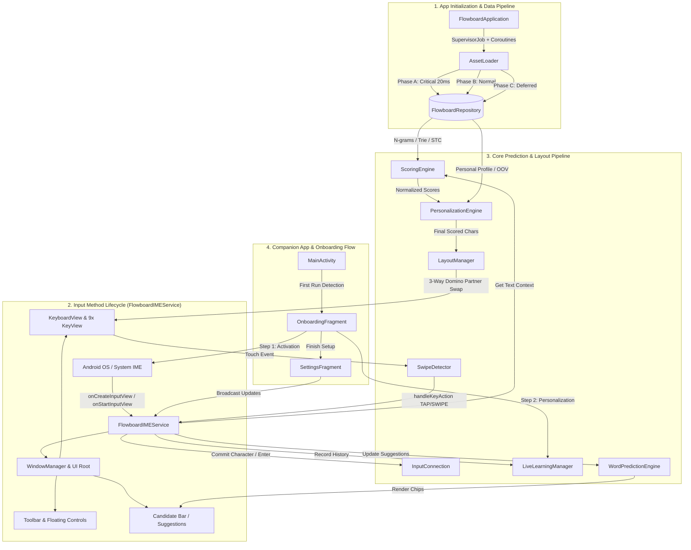
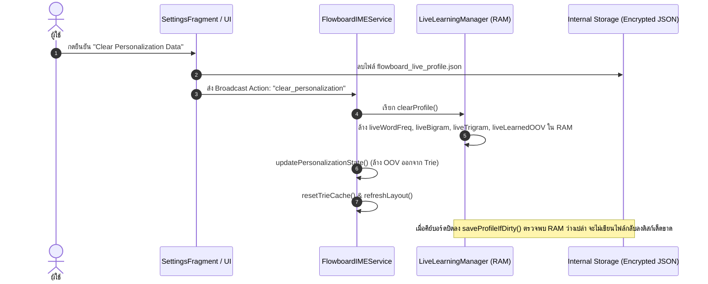

# 🏗️ Flowboard Android — System Architecture & Technical Documentation

เอกสารฉบับนี้จัดทำขึ้นสำหรับทีมนักพัฒนา (Developers, Software Engineers, และ System Architects) เพื่ออธิบายสถาปัตยกรรมโครงสร้างโค้ด วงรอบการทำงาน (Execution Lifecycle) รายชื่อฟังก์ชันหลักพร้อม Input/Output ระบบประมวลผล N-gram & Machine Learning รวมถึง **Impact Analysis Matrix (ตารางวิเคราะห์ผลกระทบ)** ที่ระบุอย่างชัดเจนว่า *หากมีการแก้ไขฟังก์ชันหรือคลาสใด จะส่งผลกระทบต่อเนื่องไปยังจุดใดบ้างในระบบ*

---

## 1. ภาพรวมสถาปัตยกรรมระบบ (System Architecture Overview)

Flowboard Android ถูกพอร์ตสถาปัตยกรรมระดับ 1:1 จาก **Prototype 22 (P22) Core** เป็นคีย์บอร์ด 9 ปุ่มที่ทำงานบนระบบ **Offline Prediction Engine 100%** โดยไม่มีการเชื่อมต่อเครือข่ายภายนอก



---

## 2. โครงสร้างโปรเจกต์และหน้าที่ของไฟล์ (Project & Package Structure)

```text
app/src/main/
├── java/com/flowboard/ime/
│   ├── FlowboardApplication.kt            # Application Entry Point & 3-Phase Coroutine Asset Pipeline
│   ├── MainActivity.kt                    # Companion App Router, Status Poller, Navigation Chrome Controller
│   ├── data/
│   │   ├── AssetLoader.kt                 # Coroutine IO JSON Deserializer & Trie Parsers
│   │   ├── FlowboardRepository.kt         # In-Memory RAM Singleton (Single Source of Truth)
│   │   ├── ClipboardManagerHelper.kt      # Local Clipboard Storage (LRU 30 items, Pin support)
│   │   ├── EmojiRepository.kt             # 9-Category Emoji Store & Recent Emojis Manager
│   │   └── models/
│   │       ├── ClusteredWordBigram.kt     # Group-compressed Word Bigram / Trigram model
│   │       ├── EngineWeights.kt           # Weights for 7 Sub-engines across 6 Context States
│   │       ├── KeySlots.kt                # 5-directional character container (tap, up, left, right, down)
│   │       ├── MasterLayout.kt            # 36-char placement mapping (homeKey, defaultSlot)
│   │       ├── PersonalProfile.kt         # User-specific bigram, trigram, wordFreq, learnedOOV
│   │       ├── Profile.kt                 # System typing rules (allow_echo, buffs, immunity)
│   │       └── TrieNode.kt                # Prefix Trie Node Data Structure (freq, endOfWord, children)
│   ├── engine/
│   │   ├── LanguageManager.kt             # Shift & CapsLock state machine (OFF / SHIFT_ONCE / CAPS_LOCK)
│   │   ├── LayoutManager.kt               # 3-Way Domino Partner Swap algorithm (36 slots mapping)
│   │   ├── LiveLearningManager.kt         # Real-time OOV learner, Capacity-Driven Aging, Encrypted JSON
│   │   ├── PersonalizationEngine.kt       # Additive zero-degradation user scoring layer
│   │   ├── ProfileManager.kt              # Profile mode manager (Default vs Chat)
│   │   ├── ScoringEngine.kt               # 6-State Contextual 7-Sub-Engine Weighted Fusion (U/B/T/D/WB/WT/STC)
│   │   └── WordPredictionEngine.kt        # Candidate Autocomplete, Next-Word, Active Prefix resolution
│   ├── service/
│   │   └── FlowboardIMEService.kt         # Main Android InputMethodService (Window, Touch, Event Loop, Broadcasts)
│   ├── testing/
│   │   └── BotTester.kt                   # Automated simulation & benchmark harness (Tap Rate testing)
│   ├── ui/
│   │   ├── EmojiAdapter.kt                # RecyclerView Adapter for Emoji Grid
│   │   ├── KeyView.kt                     # Custom Canvas-rendered View for single 9-grid key
│   │   ├── KeyboardView.kt                # Custom 3x3 ViewGroup managing 9 KeyViews
│   │   ├── SwipeDetector.kt               # 5-directional gesture recognition (TAP, UP, DOWN, LEFT, RIGHT)
│   │   ├── onboarding/
│   │   │   └── OnboardingFragment.kt      # 2-Step First-Launch Setup Wizard (Activation & Personalization)
│   │   └── settings/
│   │       ├── PersonalizationFragment.kt # Settings for Live Learning, OOV, Multipliers, Storage Info
│   │       ├── SettingsFragment.kt        # Master Settings UI & Live Activation Status Checker
│   │       ├── ShortcutsFragment.kt       # Quick Text Snippets Editor (Keys 1-9)
│   │       ├── SidebarSettingsFragment.kt # Left/Right-handed Docked & Floating Controls
│   │       └── ThemesFragment.kt          # Theme Selector UI (7 Curated Themes)
│   └── util/
│       ├── SoundHapticManager.kt          # SoundPool audio & Vibrator/VibrationEffect haptics
│       └── ThemeManager.kt                # Color palettes (7 Themes: Auto, Light, Dark, Ocean, Mint, Sunset, Sakura)
│
├── assets/
│   ├── en/                                # English Offline Models & Dictionaries
│   │   ├── unigram.json                   # Character Unigram frequencies
│   │   ├── unigram_start.json             # Start-of-word character probabilities
│   │   ├── bigram.json                    # Character Bigram transition matrix
│   │   ├── trigram.json                   # Character Trigram transition matrix
│   │   ├── trie_dict_compressed.json      # Main English Dictionary Trie (50,000+ words)
│   │   ├── trie_dict_oov.json             # Out-of-Vocabulary Base Trie
│   │   ├── clustered_word_bigram.json     # Word-level Bigram contextual transitions
│   │   ├── clustered_word_trigram_en.json # Word-level Trigram contextual transitions
│   │   ├── sentence_topic_clusters.json   # STC semantic topic clusters
│   │   ├── master_layout.json             # Default 36-char keyboard layout placement
│   │   ├── profile_chat.json              # Chat mode informal speech heuristics
│   │   ├── my_personal_profile.json       # Built-in seed personal profile
│   │   └── word_list.json                 # Vocabulary candidate list
│   └── shared/
│       ├── symbol_page_1.json             # Primary symbols & numbers layout
│       └── symbol_page_2.json             # Extended math & punctuation symbols layout
│
├── res/
│   ├── layout/
│   │   ├── activity_main.xml              # Main Companion App Container (CoordinatorLayout)
│   │   ├── fragment_onboarding.xml        # 2-Step Fullscreen Setup Wizard with Insets Protection
│   │   ├── fragment_settings.xml          # Main Settings Dashboard
│   │   ├── fragment_personalization.xml   # Personalization & Privacy Settings
│   │   ├── fragment_themes.xml            # Theme Picker Gallery
│   │   ├── fragment_sidebar_settings.xml  # Handedness & Delete Key Ergonomics
│   │   ├── fragment_shortcuts.xml         # Text Snippets Editor
│   │   ├── keyboard_layout.xml            # Floating & Docked Keyboard Root View
│   │   ├── emoji_panel.xml                # Bottom Emoji Selector Panel
│   │   ├── text_editing_panel.xml         # Cursor & Text Selection D-pad
│   │   ├── theme_quick_panel.xml          # Quick Theme Switcher Popup
│   │   ├── undo_redo_panel.xml            # History Action Controls
│   │   └── voice_input_panel.xml          # Speech-to-Text Interface
│   └── xml/
│       ├── method.xml                     # IME Subtype declaration for Android OS
│       ├── data_extraction_rules.xml      # Android 12+ Zero-Cloud Leak Exclusion Rules
│       └── backup_rules.xml               # Android 6–11 Legacy Backup Exclusion Rules
│
app/src/test/java/com/flowboard/ime/       # Unit & Persona Simulation Benchmark Suite
├── engine/
│   └── ScoringEngineTest.kt               # 7-Sub-Engine Weighting & State Transitions Test
└── testing/
    ├── BotTesterTest.kt                   # P22 Benchmark Tap Rate Simulation Test
    ├── PersonalizationLiveTest.kt         # Live Learning, OOV Ranking & Encryption Verification
    ├── HeavyUserPersonaSimulationTest.kt  # 5,000+ Words High-Capacity Stress Simulation
    ├── LongTermUserPersonaSimulationTest.kt # Multi-day Inactivity & Safe Zone Immunity Test
    ├── ShortMessagePersonaSimulationTest.kt # Light User (Few Words/Day) Zero Forgetting Test
    ├── WordPredictionEngineTest.kt        # Autocomplete, Next-Word & Prefix Resolution Test
    └── TestDataFactory.kt                 # Mock Engine & Repository Data Factory
```

---

## 3. แคตตาล็อกฟังก์ชันหลักแยกตามโมดูล (Comprehensive Function Catalog)

### 3.1 Data Layer (`data/`)

#### `AssetLoader.kt`
* `loadCriticalData(repo: FlowboardRepository): Unit` (suspend)
  * **Input:** `FlowboardRepository`
  * **Output:** โหลด `unigram`, `master_layout`, `symbol_page_1/2` และเรียก `repo.markReady()` (~20ms)
* `loadNormalData(repo: FlowboardRepository): Unit` (suspend)
  * **Input:** `FlowboardRepository`
  * **Output:** โหลด `bigram`, `trigram`, `trie_dict_compressed`, `word_list`, `clustered_word_bigram`, `unigram_start`, `profile_chat`
* `loadDeferredData(repo: FlowboardRepository): Unit` (suspend)
  * **Input:** `FlowboardRepository`
  * **Output:** โหลด `trie_dict_oov`, `clustered_word_trigram_en`, `sentence_topic_clusters`, `my_personal_profile` และเรียก `repo.markFullyLoaded()`
* `loadMasterLayout(path: String): Map<String, MasterLayoutEntry>`
  * **Input:** พาธของ Master Layout JSON (default `en/master_layout.json`)
  * **Output:** Map ของการจัดวางตัวอักษร 36 ตัวลงใน Home Key และ Slot เริ่มต้น
* `updatePersonalizationState(ctx: Context, repo: FlowboardRepository): Unit`
  * **Input:** Android `Context`, `FlowboardRepository`
  * **Output:** ตรวจสอบ `personalization_enabled` หากเปิดอยู่จะ Inject Learned OOV เข้า `trieDictOOV` หากปิดอยู่จะสลับกลับไปใช้ `baseTrieDictOOV` และเซ็ต `isPersonalizationEnabled = false`

#### `ClipboardManagerHelper.kt`
* `getItems(): List<ClipboardItem>`
  * **Output:** รายการข้อความในคลิปบอร์ดทั้งหมด เรียงตาม Pinned และ Timestamp
* `addClip(text: String): ClipboardItem?`
  * **Input:** ข้อความใหม่ `String`
  * **Output:** เพิ่มข้อความเข้าประวัติ (จำกัดสูงสุด 30 รายการแบบ LRU โดยเก็บรายการ Pinned ไว้)
* `togglePin(id: String): Boolean`
  * **Input:** ID ของคลิปบอร์ด
  * **Output:** สลับสถานะ Pin/Unpin และจัดเรียงรายการใหม่
* `clearUnpinned(): Unit`
  * **Output:** ลบข้อความที่ไม่ได้ปักหมุดทั้งหมด

#### `EmojiRepository.kt`
* `getEmojisForCategory(context: Context, category: EmojiCategory): List<String>`
  * **Input:** `EmojiCategory` (RECENT, SMILEYS, PEOPLE, ANIMALS, FOOD, TRAVEL, ACTIVITIES, OBJECTS, FLAGS)
  * **Output:** รายชื่ออีโมจิในหมวดหมู่นั้นๆ
* `addRecentEmoji(context: Context, emoji: String): Unit`
  * **Input:** อีโมจิที่ถูกเลือก
  * **Output:** บันทึกลง SharedPreferences ในหมวด RECENT (สูงสุด 40 ตัว)

---

### 3.2 Core Prediction & Scoring Engine (`engine/`)

#### `ScoringEngine.kt`
* `calculateScores(text: String): Map<String, Double>`
  * **Input:** ข้อความก่อนเคอร์เซอร์ (`text`)
  * **Output:** Map ของคะแนนความน่าจะเป็นของตัวอักษร 26 ตัว (`a-z`) และสัญลักษณ์ที่รองรับ
  * **Logic:**
    1. ตรวจสอบ Context State (1, 2, 3, 4, 7, 8)
    2. คำนวณคะแนนจาก 7 Sub-engines (U, B, T, D, WB, WT, STC) ตาม `STATE_WEIGHTS` ล่าสุด
    3. ตรวจจับ OOV Decay (หากไม่มีคำใน Trie ให้โอนน้ำหนัก D $\rightarrow$ T)
    4. หลอมรวมคะแนนถ่วงน้ำหนัก (Weighted Score Fusion)
    5. ปรับแต่งด้วย Echo Booster, Bonus Dict, และ Unigram Tiebreaker
    6. ส่งต่อให้ `PersonalizationEngine` บวกคะแนนส่วนบุคคล (Additive Layer)
* `resetTrieCache(): Unit`
  * **Output:** ล้างแคช Trie Node สำหรับการเริ่มประโยคใหม่
* `isDoubleCharValid(text: String, lastChar: String): Boolean`
  * **Input:** ข้อความย้อนหลัง และตัวอักษรล่าสุด
  * **Output:** `Boolean` ระบุว่าตัวอักษรนี้สามารถพิมพ์ซ้ำ (Sticky Key) ได้หรือไม่ตามกฎภาษาอังกฤษ

#### `LayoutManager.kt`
* `assignLayout(scores: Map<String, Double>): Map<String, KeySlots>`
  * **Input:** Map คะแนนตัวอักษรจาก `ScoringEngine`
  * **Output:** ผัง 9 ปุ่ม (`key_1` ถึง `key_9`) พร้อมตัวอักษรประจำ 5 ตำแหน่ง (`tap`, `up`, `left`, `right`, `down`)
  * **Logic:**
    1. `buildBaseLayout()`: จัดวางตัวอักษรลง Home Key ตาม Master Layout โดยใช้ `LAZY_TAP_RATIO = 1.15`
    2. `partnerSwapEN()`: สลับตัวอักษรรองข้ามปุ่มคู่หูแบบ 3-Way Domino Partner Swap
    3. `fillUnrenderedChars()`: เกลี่ยตัวอักษรที่เหลือให้ครบ 36 ช่อง

#### `WordPredictionEngine.kt`
* `getActivePrefix(fullText: String): String`
  * **Input:** ข้อความก่อนหน้าเคอร์เซอร์ (`fullText`)
  * **Output:** คืนค่า `""` หากอยู่ในโหมด Next-Word (หลังเว้นวรรค/เครื่องหมายวรรคตอน) หรือคืนค่าตัวอักษรท้ายคำที่กำลังพิมพ์ (Prefix Completion Mode เช่น `"mor"`, `"john@"`)
* `getPredictions(fullText: String, maxCount: Int = 3): List<String>`
  * **Input:** ข้อความก่อนเคอร์เซอร์ และจำนวนคำที่ต้องการ (default 3)
  * **Output:** รายการคำแนะนำ 3 คำที่สอดคล้องกับบริบทและ Casing (พิมพ์เล็ก/ใหญ่)

#### `PersonalizationEngine.kt`
* `applyPersonalization(finalScores: HashMap<String, Double>, activeWordsArray: List<String>, activePrefix: String, state: Int): Unit`
  * **Input:** Map คะแนนเดิม, รายการคำก่อนหน้า, Prefix ปัจจุบัน, State ปัจจุบัน
  * **Output:** แก้ไข `finalScores` ในหน่วยความจำโดยตรงแบบ Additive (+Logarithmic Bonus)
  * **Rules:**
    * คำคู่ Bigram/Trigram ส่วนบุคคล
    * Uncertain Gap Boosting เมื่อคะแนน Top 2 สูสีกัน ($\Delta_{gap} < 15.0$)
    * ห้ามให้คะแนนแก่ตัวเลข (0-9) เด็ดขาด

#### `LiveLearningManager.kt`
* `loadProfile(): Unit`
  * **Output:** ถอดรหัสไฟล์ `flowboard_live_profile.json` ด้วย `EncryptedFile` (AES-256 GCM) และโหลดประวัติคำศัพท์เข้า RAM หากไฟล์ไม่มีอยู่จริงบนดิสก์ จะสั่งล้าง Map ใน RAM ทันที (`liveWordFreq.clear()`, `liveBigram.clear()`, `liveTrigram.clear()`, `liveLearnedOOV.clear()`) เพื่อป้องกันปัญหา Ghost Profile Resurrection
* `recordWordTyped(fullText: String): Unit`
  * **Input:** ประโยคหรือข้อความที่พิมพ์
  * **Output:** ดักจับคำศัพท์ใหม่ อีเมล อัปเดต Bigram/Trigram ใน RAM และ Inject เข้า `trieDictOOV` ทันที (จะเริ่มตรวจสอบ Capacity Watermark เมื่อพิมพ์ครบทุกๆ `WORDS_BETWEEN_DECAY_CHECK = 500` คำ)
* `isCapacityPressureHigh(): Boolean`
  * **Output:** คืนค่า `true` หากขนาดความจุคำศัพท์ $\ge 85\%$ (`HIGH_WATERMARK_RATIO = 0.85`)
* `applyAgingDecay(decayFactor: Double = 0.95): Unit`
  * **Input:** Factor การลดทอน (default 0.95)
  * **Output:** ทำงานเฉพาะเมื่อความจุเกิน High Watermark ($\ge 85\%$) โดยคำที่มีความถี่ $\ge 3$ จะได้รับการคุ้มครอง (`floor = 1`) ไม่ให้แตะ 0 ส่วนคำ Typo ที่พิมพ์ครั้งเดียวจะถูกลืมและลบออกจากระบบ
* `saveProfileIfDirty(): Unit`
  * **Output:** เข้ารหัส In-Memory Profile ด้วย `EncryptedFile` (AES-256 GCM) บันทึกลงไฟล์ `flowboard_live_profile.json` บน Internal Storage แบบ Atomic File Swap (`.tmp`) เมื่อคีย์บอร์ดปิด หาก Map ใน RAM ว่างเปล่าจะสั่งลบไฟล์ทิ้งอัตโนมัติ
* `clearProfile(): Unit`
  * **Output:** ล้างข้อมูล In-Memory Maps ทั้งหมดใน RAM และลบไฟล์บน Internal Storage ทิ้งทันที

---

### 3.3 Companion App & UI Layer (`ui/onboarding/`, `ui/settings/`, `service/`, `util/`)

#### `OnboardingFragment.kt`
* `setupStep1(mainActivity: MainActivity): Unit`
  * **Output:** ผูกปุ่ม "Enable in Settings" และ "Switch to Flowboard" พร้อม ContentObserver ดักสถานะคีย์บอร์ดแบบ Real-time (แสดงป้าย `✓ Enabled` และ `✓ Selected` เมื่อเปิดสำเร็จ)
* `setupStep2(mainActivity: MainActivity): Unit`
  * **Output:** แสดงการ์ด 100% On-Device AES-256 GCM Encryption และสวิตช์เปิด/ปิด Personalization (Recommended ON)
* `finishOnboarding(mainActivity: MainActivity): Unit`
  * **Output:** บันทึก `onboarding_completed = true` พร้อมบันทึกค่า Default ทั้งหมด (Height: 1.25x, Theme: System Default, Side Bar: Left, Delete Key: Right, Sound: ON, Vibration: ON), ส่ง Broadcast ไปยัง IME Service และเปิดหน้า `SettingsFragment`
* **Window Insets Isolation**: ใช้ `ViewCompat.setOnApplyWindowInsetsListener` และ `android:fitsSystemWindows="true"` คำนวณความสูง Status Bar และ Navigation Bar แบบ Pixel-perfect ป้องกันไม่ให้ส่วนหัวของ Onboarding ทับไอคอนสถานะของ Android

#### `FlowboardIMEService.kt`
* `BroadcastReceiver (flowboard_settings_changed)`:
  * ดักจับการเปลี่ยนแปลงการตั้งค่าแบบ Real-time:
    * `"sound_on_keypress"`, `"vibration_on_keypress"` $\rightarrow$ ปรับเสียงและสั่นทันที
    * `"docked_side_tools_left"` $\rightarrow$ ย้ายแถบเครื่องมือซ้าย/ขวา
    * `"delete_btn_fixed_side"`, `"delete_btn_follow_side_tools"` $\rightarrow$ ปรับตำแหน่งปุ่ม Backspace
    * `"personalization_enabled"` $\rightarrow$ โหลด/ล้าง Profile, สลับ Trie OOV, รีเซ็ตแคช Trie และคำนวณผังใหม่
    * `"clear_personalization"` $\rightarrow$ ล้าง RAM ทันทีและรีเฟรชคีย์บอร์ด

---

## 4. ตารางวิเคราะห์ผลกระทบ (Impact Analysis Matrix)

> [!IMPORTANT]
> ตารางนี้ระบุความเชื่อมโยงระดับฟังก์ชัน/คลาส เพื่อให้ประเมินความเสี่ยงและผลกระทบข้างเคียง (Blast Radius) ก่อนลงมือแก้ไขโค้ด

| โมดูล / ฟังก์ชันเป้าหมาย | เรียกใช้โดย (Incoming Callers) | เรียกใช้อะไรต่อ (Outgoing Calls) | ผลกระทบหากมีการแก้ไข (Blast Radius / Side Effects) |
|---|---|---|---|
| **`FlowboardRepository`** (Singleton) | เกือบทุกไฟล์ในโปรเจกต์ (`AssetLoader`, `ScoringEngine`, `LayoutManager`, `FlowboardIMEService`) | `StateFlow` | 🔴 **CRITICAL (ทั้งระบบ):** หากโครงสร้าง State หรือตัวแปรเปลี่ยน จะกระทบ Data Pipeline, การคำนวณคะแนน, ผังคีย์บอร์ด และทำให้ Test ทั้งหมดล้มเหลว |
| **`AssetLoader.loadCriticalData()`** | `FlowboardApplication.onCreate()` | `FlowboardRepository.markReady()` | 🔴 **CRITICAL:** กระทบ Cold start time ของคีย์บอร์ด หากโหลดช้าหรือพัง คีย์บอร์ดจะไม่สามารถ Render ได้ (ติดหน้าจอว่าง) |
| **`ScoringEngine.calculateScores()`** | `FlowboardIMEService.refreshLayout()`, `BotTester.runTest()` | `getUnigramScores()`, `getDictScores()`, `PersonalizationEngine` | 🔴 **CRITICAL:** กำหนดความแม่นยำของตัวอักษรทั้งหมด หากแก้ตรรกะนี้ Tap Rate ของคีย์บอร์ดจะเปลี่ยนทันที กระทบ `BotTester` Benchmark |
| **`LayoutManager.assignLayout()`** | `FlowboardIMEService.refreshLayout()`, `BotTester.runTest()` | `buildBaseLayout()`, `partnerSwapEN()`, `fillUnrenderedChars()` | 🔴 **CRITICAL:** จัดการผัง 9 ปุ่ม หากแก้ผิดพลาด ตัวอักษรอาจหายไปจากแป้น, เกิดการทับซ้อน (Duplicate char), หรือ Domino Swap ทำงานผิดทิศทาง |
| **`LiveLearningManager.loadProfile() / saveProfileIfDirty()`** | `FlowboardIMEService.onCreate()`, `onFinishInput()`, `BroadcastReceiver` | `EncryptedFile`, `FlowboardRepository.personalProfile` | 🟠 **HIGH:** จัดการไฟล์โปรไฟล์ที่เข้ารหัส หากแก้ผิดพลาดอาจทำให้ข้อมูลส่วนบุคคลกู้คืนไม่ได้หรือเกิด Ghost Profile Resurrection |
| **`LiveLearningManager.applyAgingDecay()`** | `LiveLearningManager.recordWordTyped()` | `liveWordFreq`, `liveBigram`, `liveTrigram` | 🟡 **MEDIUM:** ทำงานเฉพาะเมื่อความจุเกิน $85\%$ หากแก้สูตรผิด คำศัพท์ที่ใช้บ่อยอาจถูกลบ |
| **`OnboardingFragment`** | `MainActivity.handleIntent()` (First Launch) | `SettingsFragment`, `FlowboardIMEService` Broadcast | 🟡 **MEDIUM:** ประสบการณ์เปิดแอปครั้งแรก หาก Insets พัง หน้าจอจะกินพื้นที่ Status Bar ด้านบน |
| **`FlowboardIMEService.handleKeyAction()`** | `KeyView` Touch Listener via `SwipeDetector` | `InputConnection.commitText()`, `refreshLayout()`, `updatePredictions()` | 🔴 **CRITICAL:** จุดเชื่อมต่อหลักระหว่างการพิมพ์กับ Android OS หากมี Bug จะทำให้ตัวอักษรไม่ถูกส่งเข้าแอปเป้าหมาย |

---

## 5. วงรอบการทำงานเมื่อเกิดการกด 1 ตัวอักษร (Single Keystroke Event Loop)

```text
1. User Touch Down/Move/Up บน KeyView
   └─► SwipeDetector.onTouchEvent(event)
       └─► คำนวณเวกเตอร์ระยะทาง (dx, dy) เทียบ thresholdPx (25dp)
           └─► SwipeDetector.onAction(TAP / UP / DOWN / LEFT / RIGHT)
               └─► FlowboardIMEService.handleKeyAction(action, keySlots, keyIndex)
                   ├─► SoundHapticManager.playTap() / playSwipe() (เปิดใช้งานเป็นค่าเริ่มต้น)
                   ├─► ดึงตัวอักษรเป้าหมายจาก keySlots (เช่น slot 'tap' -> "h")
                   ├─► LanguageManager.applyCase("h") -> "H" (หากเปิด Shift)
                   ├─► InputConnection.commitText("H", 1) (ส่งข้อความเข้า OS)
                   ├─► LiveLearningManager.recordWordTyped(fullTextBeforeCursor)
                   ├─► ScoringEngine.calculateScores(fullTextBeforeCursor)
                   │   ├─► คำนวณคะแนนจาก 7 Sub-engines (U, B, T, D, WB, WT, STC)
                   │   ├─► ตรวจจับ OOV Decay & Echo Rules
                   │   └─► PersonalizationEngine.applyPersonalization() (บวกโบนัสส่วนบุคคล)
                   ├─► LayoutManager.assignLayout(finalScores)
                   │   ├─► buildBaseLayout() (Lazy Tap 1.15x)
                   │   ├─► partnerSwapEN() (3-Way Domino Partner Swap)
                   │   └─► fillUnrenderedChars() (เกลี่ยตัวอักษรลง 36 ช่อง)
                   ├─► KeyboardView.updateLayout(newLayout) -> KeyView.invalidate()
                   └─► WordPredictionEngine.getPredictions(fullTextBeforeCursor)
                       └─► Render ผลลัพธ์ 3 คำลงบน Candidate Bar (Suggestion Chips)
```

---

## 6. สถาปัตยกรรม Capacity-Driven Watermark Forgetting & High-Frequency Protection

### 6.1 ปัญหาเดิมของ Time-based Aging
ในระบบเดิม การลดทอนคำศัพท์ (Aging Decay) ทำงานตามเวลาแบบรายวัน (`DAY_MILLIS`) ทำให้เกิดจุดอ่อนร้ายแรง 2 ประการ:
1. **ผู้ใช้ที่พิมพ์น้อย (Light Users)**: หากพิมพ์เพียงวันละไม่กี่คำ คำศัพท์ที่เพิ่งเรียนรู้จะถูกลืมและหายไปอย่างรวดเร็วทั้งที่เป็นคำที่ผู้ใช้ต้องการให้จำ
2. **การเว้นช่วงการใช้งาน (Inactivity / Vacations)**: เมื่อผู้ใช้ไม่ได้เปิดแอปเป็นเวลาหลายวัน ข้อมูลในโปรไฟล์จะเสื่อมถอยไปเรื่อยๆ จนว่างเปล่า

### 6.2 กลไก Capacity Watermark Architecture
Flowboard จึงเปลี่ยนมาใช้สถาปัตยกรรม **Capacity-Driven Watermark Forgetting** ซึ่งผูกวงรอบการลืมคำศัพท์เข้ากับ **"ระดับการใช้งานจริงและความจุของพื้นที่จัดเก็บ"**:

```
                  ┌─────────────────────────────────────────────────────────┐
                  │              Total Capacity: 1,000 Words                │
                  └─────────────────────────────────────────────────────────┘
                                               ▲
                                               │
   [ 0% - 84% Capacity ] ──────────────────────┼──► SAFE ZONE: 0% Decay (ห้ามลืมเด็ดขาด)
   (คำศัพท์ไม่ถึง 850 คำ)                        │   Light users / Inactive periods ปลอดภัย 100%
                                               │
   [ ≥ 85% High Watermark ] ───────────────────┼──► HIGH WATERMARK TRIGGER: เริ่มเปิด Decay
   (คำศัพท์แตะ 850 คำขึ้นไป)                     │   - Prune เฉพาะคำ Typo / ขยะที่พิมพ์ครั้งเดียว (< 1.0)
                                               │   - คำที่พิมพ์ ≥ 3 ครั้ง ได้รับ Floor Protection (ไม่ตกเป็น 0)
                                               │
   [ Decay Runs Every 500 Words Typed ] ───────┴──► รอบการคำนวณตรวจสอบ (WORDS_BETWEEN_DECAY_CHECK)
```

### 6.3 ค่าคงที่และสูตรการคำนวณ (Mathematical Formulation)
* **`HIGH_WATERMARK_RATIO = 0.85`** (ขีดเริ่มทำงาน: 85% ของเพดาน `MAX_WORD_FREQ = 1000`)
* **`LOW_WATERMARK_RATIO = 0.70`** (ขีดปลอดภัย: 70% ของเพดาน)
* **`HIGH_FREQ_PROTECTION_COUNT = 3`** (เกณฑ์คุ้มครองคำศัพท์ประจำ)
* **`WORDS_BETWEEN_DECAY_CHECK = 500`** (ความถี่ในการประเมินความจุ)

$$\text{isCapacityPressureHigh}() = (\text{liveWordFreq.size} \ge 850) \lor (\text{liveBigram.size} \ge 1700)$$

$$\text{newCount} = \begin{cases} 
\text{count} & \text{ถ้า } \text{isCapacityPressureHigh}() = \text{false} \text{ (Safe Zone)} \\
\max(1, \text{round}(\text{count} \times 0.95)) & \text{ถ้า } \text{count} \ge 3 \text{ (High-Frequency Immunity Floor)} \\
\text{round}(\text{count} \times 0.95) & \text{ถ้า } \text{decayed} \ge 1.0 \\
0 \text{ (Pruned from Memory \& Disk)} & \text{ถ้า } \text{decayed} < 1.0 \text{ (Typo Elimination)}
\end{cases}$$

---

## 7. การแก้ไขบั๊กล้างข้อมูลส่วนบุคคล (Ghost Profile Resurrection Bug Fix)

### 7.1 ปัญหาเดิม (Root Cause Analysis)
เมื่อผู้ใช้กด **"Clear Personalization Data"** ในหน้าการตั้งค่า ไฟล์ `flowboard_live_profile.json` บน Internal Storage ถูกลบออกไปจริง แต่เมื่อผู้ใช้เปิดแป้นพิมพ์ขึ้นมาพิมพ์ ข้อความเดิมกลับฟื้นคืนชีพกลับมา (Resurrected) สาเหตุเกิดจาก **3 จุดบกพร่องต่อเนื่อง**:
1. **RAM Desynchronization**: การกดล้างข้อมูลใน `SettingsFragment` ทำการลบไฟล์บนดิสก์ แต่ไม่ได้ส่งสัญญาณไปสั่งล้างหน่วยความจำใน `FlowboardIMEService` ที่กำลังรันอยู่เบื้องหลัง
2. **Ghost Save Cycle**: เมื่อคีย์บอร์ดปิดลง เมธอด `saveProfileIfDirty()` ตรวจพบ In-Memory Maps (`liveWordFreq`, `liveBigram`) ที่ยังค้างอยู่ใน RAM จึงทำการเข้ารหัสและบันทึกกลับลงดิสก์ สร้างไฟล์ผีขึ้นมาใหม่
3. **Implicit Re-population**: ใน `loadProfile()` เดิม เมื่อตรวจพบว่าไฟล์บนดิสก์ไม่มีอยู่จริง ไม่ได้ทำการเคลียร์ working maps ใน RAM ให้ว่างเปล่า

### 7.2 สถาปัตยกรรมการแก้ไข 3 ระดับ (Three-Pronged Immunity Fix)



1. **Dedicated Broadcast Handler**: ใน [`FlowboardIMEService.kt`](file:///home/mey/Project/flowboard/Flowboard-android/app/src/main/java/com/flowboard/ime/service/FlowboardIMEService.kt) เพิ่มการดักจับ Broadcast `"clear_personalization"` เพื่อเรียก `liveLearningManager.clearProfile()`, `AssetLoader.updatePersonalizationState()` และ `scoringEngine.resetTrieCache()` ล้าง RAM แบบทันทีทันใด
2. **Strict In-Memory Purge on Absence**: ใน `LiveLearningManager.loadProfile()` หากตรวจพบว่าไฟล์บนดิสก์ไม่มีอยู่จริง จะสั่ง `clear()` คอลเลกชันใน RAM ทุกตัวทันที
3. **Empty Disk-Write Guard**: ใน `LiveLearningManager.saveProfileIfDirty()` หากทุก Map ใน RAM มีขนาดเป็น 0 จะสั่งลบไฟล์บนดิสก์ทิ้งแทนที่จะบันทึกไฟล์ว่างเปล่า

---

## 8. ค่าเริ่มต้นของระบบและกระบวนการ Onboarding (Factory Defaults & Onboarding Flow)

### 8.1 ผังค่าเริ่มต้นของระบบ (Factory Defaults Matrix)

| การตั้งค่า (Feature) | ค่าเริ่มต้น (Default) | คีย์ SharedPreferences & ชนิดข้อมูล | พฤติกรรมการทำงาน |
|---|---|---|---|
| **ขนาดคีย์บอร์ด (Height)** | **Medium** | `docked_keyboard_scale = 1.25f` (Float) | ปรับความสูงแป้นพิมพ์และขนาดตัวอักษรให้พอดีกับนิ้วมือ |
| **ธีมคีย์บอร์ด (Theme)** | **Auto** | `active_theme = "System default"` (String) | ปรับเปลี่ยนสีตามโหมด Light/Dark ของระบบ Android อัตโนมัติ |
| **ตำแหน่งแถบเครื่องมือ (Sidebar)** | **ชิดซ้าย (Left)** | `docked_side_tools_left = true` (Boolean) | วางแถบเครื่องมือ (อิโมจิ, คลิปบอร์ด, ตั้งค่า) ไว้ฝั่งซ้ายของแป้น |
| **ตำแหน่งปุ่มลบ (Delete Button)** | **ชิดขวา (Right)** | `delete_btn_follow_side_tools = false`<br/>`delete_btn_fixed_side = "right"` | ตรึงปุ่ม Backspace ไว้ฝั่งขวาเสมอ |
| **เสียงกดปุ่ม (Sound on keypress)** | **เปิด (ON)** | `sound_on_keypress = true` (Boolean) | เล่นเสียงคีย์บอร์ดตอบสนองทุกการสัมผัส |
| **การสั่นสัมผัส (Vibration)** | **เปิด (ON)** | `vibration_on_keypress = true` (Boolean) | สั่น Haptic Feedback ทุกการแตะและสไวป์ |
| **การปรับแต่งส่วนบุคคล (Personalization)** | **เปิด (Recommended)** | `personalization_enabled = true` (Boolean) | จดจำคำศัพท์และคู่คำแบบเข้ารหัสในเครื่อง 100% |

### 8.2 กระบวนการ Setup Wizard ครั้งแรก (2-Step Onboarding)
* **Step 1 (Welcome & Activation)**: ตรวจจับสถานะการเปิดใช้งานและเลือก Flowboard แบบสดๆ ด้วย ContentObserver (แสดงป้าย `✓ Enabled` และ `✓ Selected`)
* **Step 2 (Smart Personalization)**: อธิบายความปลอดภัย AES-256 GCM Hardware-backed Isolation และให้สวิตช์เลือกเปิด (แนะนำ) หรือปิด ก่อนกด "Finish Setup & Start Typing"
* **Window Insets Protection**: ใช้ `ViewCompat.setOnApplyWindowInsetsListener` ร่วมกับ `android:fitsSystemWindows="true"` แยกพื้นที่ของ Android Status Bar และ Navigation Bar ออกจากหน้าต่าง Onboarding ป้องกันบัคหน้าจอทับซ้อนไอคอนระบบ

---

## 9. สถาปัตยกรรมความปลอดภัยและการเข้ารหัส (Security & Encryption Policy)

1. **100% On-Device Isolation**: ประวัติการพิมพ์และคำศัพท์ส่วนบุคคลไม่ถูกส่งออกนอกเครื่องเด็ดขาด
2. **Zero Cloud Backup**: ปิดการสำรองข้อมูลอัตโนมัติขึ้น Google Drive ทั้งหมดผ่าน `android:allowBackup="false"`, `data_extraction_rules.xml` และ `backup_rules.xml`
3. **Hardware-Backed AES-256 GCM Encryption**: ไฟล์ `flowboard_live_profile.json` ถูกเข้ารหัสด้วย `EncryptedFile` ภายใต้ Android Keystore ที่ควบคุมโดย Trusted Execution Environment (TEE) / Hardware Security Module
4. **Ghost Resurrection Immunity**: เมื่อล้างข้อมูลส่วนบุคคล ระบบจะส่ง Broadcast ล้าง RAM ทันที และตรวจสอบความมีอยู่ของไฟล์บนดิสก์เพื่อป้องกันไม่ให้ข้อมูลเก่าฟื้นกลับมาในหน่วยความจำ
