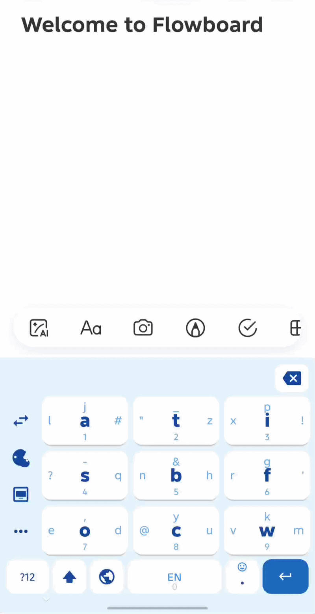
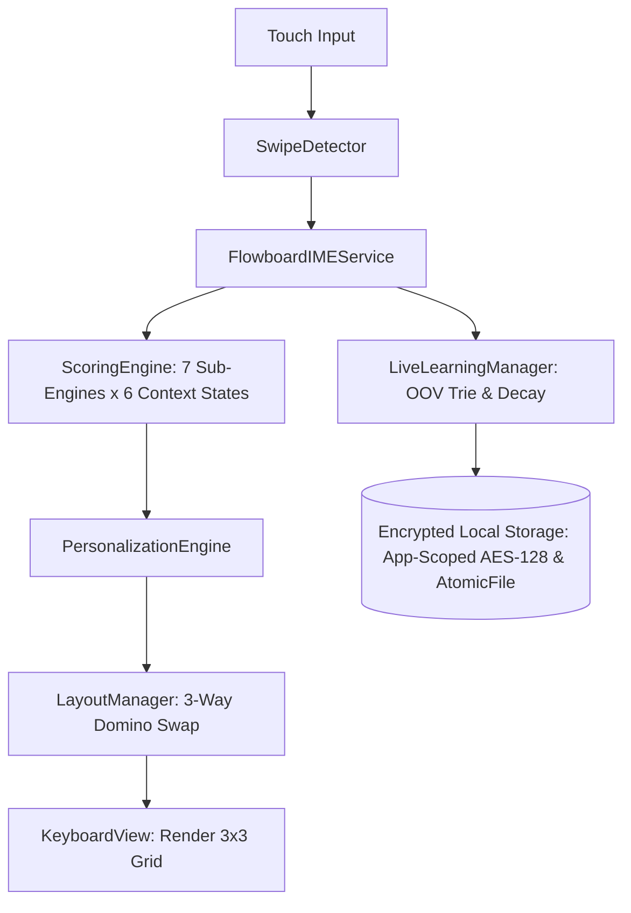

# Flowboard for Android

[](.github/workflows/android-ci.yml)
[](app/src/test)
[](LICENSE)
[](SECURITY.md)
[](https://developer.android.com/)

**Flowboard** is an ergonomic, single-handed 9-key keyboard for Android. Instead of cramming 26 small keys onto a mobile screen, Flowboard uses a 3×3 key grid and a real-time prediction engine to dynamically place the most probable next letter into the main **Tap** position.

<p align="center">
  
</p>

---

## How It Works

```
┌───────────┬───────────┬───────────┐
│     l     │     a     │     i     │
│ _   J   # │ "   Z   t │ x   P   f │
│     1     │     2     │     3     │
├───────────┼───────────┼───────────┤
│     o     │     &     │     ?     │
│ ,   Q   s │ n   B   h │ r   G   ' │
│     4     │     5     │     6     │
├───────────┼───────────┼───────────┤
│     !     │     y     │     w     │
│ e   D   - │ @   C   u │ k   V   m │
│     7     │     8     │     9     │
└───────────┴───────────┴───────────┘
```

* **Tap:** Types the highlighted center letter (predicted dynamically).
* **Swipe Up / Left / Right:** Accesses secondary letters and punctuation.
* **Swipe Down:** Quick number input (1–9).
* **Dynamic Character Swap:** As you type, the engine evaluates n-grams, Trie dictionaries, and sentence context to move the next most likely character to the Tap position on its key.

---

## Features

* **High Tap Accuracy:** Achieves over 94% tap rate on standard English text, reducing swipe and reach effort.
* **Smart Autocomplete & Next-Word Prediction:** Combines unigram, bigram, trigram, and sentence topic clusters (STC) for natural word suggestions.
* **On-Device Live Learning:** Learns new vocabulary, slang, emails, and acronyms in real time without external servers.
* **100% Offline & Private:** Zero internet permissions requested (`android.permission.INTERNET` is omitted). Your keystrokes never leave your phone.
* **App-Scoped AES Encryption & Atomic Storage:** Learned vocabulary and user profiles are stored locally using App-Scoped AES-128 GCM encryption and managed atomically via `AtomicFile` for corruption-proof persistence.
* **Floating & Docked Modes:** Resize, drag, or dock the keyboard to the left or right side for easy thumb reach.
* **Clipboard History & Shortcuts:** Built-in clipboard manager (up to 30 items) with quick-paste pins and customizable text snippets for keys 1–9.
* **Theme Support:** Includes System Default (Day/Night auto-switch), Clean Light, Pitch Dark, Ocean Blue, Mint Teal, Sunset Coral, and Sakura Bloom.
* **Developer Mode (Advanced Engine Tuner):** Fine-tune scoring weights, lazy tap ratios, partner swap thresholds, and custom key layouts directly in the settings.

---

## Architecture Overview



Flowboard evaluates next-letter probabilities across 6 distinct input states:
1. **State 1:** Start of word (unigram and start priors).
2. **State 2:** 1-character prefix (trigram and bigram weighted).
3. **State 3:** 2-character prefix (word transition model).
4. **State 4:** 3+ character prefix (deep Trie traversal with precomputed exponential decay).
5. **State 7:** Standard spacebar (next-word prediction).
6. **State 8:** Connector spacebar (sentence topic clusters after prepositions/articles).

For complete technical details, see [ARCHITECTURE.md](ARCHITECTURE.md).

---

## Building from Source

### Prerequisites
* Android Studio Ladybug (2024.2+) or newer
* JDK 17
* Android SDK 35 (minSdk 24)

### Build Commands

```bash
# Clone the repository
git clone https://github.com/LaZZy-Bear/flowboard.git
cd flowboard

# Run unit tests
./gradlew testDebugUnitTest

# Build debug APK
./gradlew assembleDebug
```

The compiled APK will be located at `app/build/outputs/apk/debug/app-debug.apk`.

---

## Privacy & Security

Flowboard is built with a zero-telemetry policy:
* **No network access:** No analytics, trackers, or network calls.
* **Sensitive field protection:** Learning is automatically disabled in password fields and Incognito/private browsing sessions (`IME_FLAG_NO_PERSONALIZED_LEARNING`).
* **No cloud backups:** Keystroke data and dictionaries are explicitly excluded from Google Drive backups.

See [SECURITY.md](SECURITY.md) for our full security policy.

---

## Contributing

Contributions, bug reports, and feature suggestions are welcome! Please read [CONTRIBUTING.md](CONTRIBUTING.md) for development setup and contribution guidelines.

---

## License

This project is licensed under the **Apache License 2.0**. See the [LICENSE](LICENSE) file for details.
