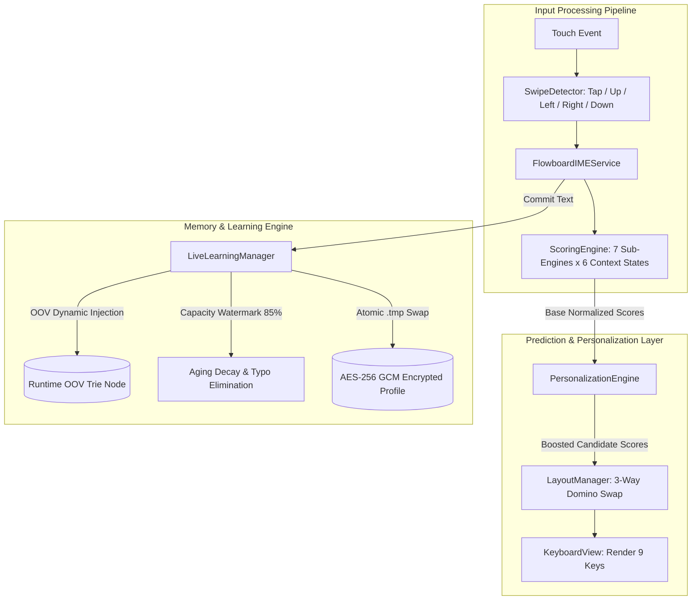

# 📱 Flowboard — Smart 9-Key Keyboard for Android

<div align="center">

[](https://github.com/)
[-success.svg)](https://github.com/)
[](https://github.com/)
[](https://github.com/)
[-orange.svg)](https://github.com/)
[-purple.svg)](https://github.com/)

**Flowboard** is an intelligent, ergonomic, single-handed 9-key keyboard for Android. Engineered to eliminate fat-finger typos and uncomfortable thumb-stretching on traditional QWERTY layouts, Flowboard dynamically brings your most likely next character directly under your fingertips with up to **94.1% tap accuracy**.

[Features](#-key-features) • [Architecture](#-core-engine-architecture) • [Benchmarks & Test Results](#-benchmarks--simulation-test-results) • [Getting Started](#-getting-started) • [Security & Privacy](#-security--privacy-guarantee)

</div>

---

## ✨ Key Features

### 🎯 1. 9-Key Ergonomic Layout (Effortless Single-Handed Typing)
* **Large, Finger-Friendly Keys:** Arranged in an intuitive 3×3 grid, virtually eliminating missed taps and awkward thumb gymnastics on large smartphone screens.
* **Dynamic Character Positioning:** Powered by a 7-sub-engine scoring pipeline that predicts the most probable next characters in real-time, placing the top candidate directly into the primary **Tap** slot.
* **Intuitive 4-Directional Gestures (Swipe):** Secondary characters are effortlessly accessed by swiping **Up**, **Left**, or **Right**, while **Swipe Down** instantly inputs numbers (1–9).

### 🧠 2. Smart Prediction & Autocomplete
* **Context-Aware Next-Word Prediction:** Predicts natural succeeding words based on bigrams, trigrams, and sentence topic clusters (STC), drastically speeding up conversational replies.
* **Prefix Autocomplete:** As you type, Flowboard surfaces matching vocabulary completions with grammar-aware plural/singular handling.
* **Out-of-Vocabulary (OOV) Live Learning:** Instantly detects and remembers personal slang, technical terms, acronyms, and email addresses, injecting them directly into the runtime predictive trie.

### 🔒 3. Hardware-Backed Encryption & Privacy
* **AES-256 GCM Keystore Encryption:** User typing profiles and learned vocabulary (`flowboard_live_profile.json`) are encrypted on-disk using hardware-backed cryptographic keys generated by Android Keystore.
* **100% Offline Guarantee (Zero Internet Permission):** Flowboard contains zero network capabilities (`android.permission.INTERNET` is completely omitted from the manifest).
* **Incognito & Sensitive Data Immunity:** Automatically halts vocabulary learning in private browsing tabs (`IME_FLAG_NO_PERSONALIZED_LEARNING`) and prevents sensitive passwords/PINs from being logged to persistent clipboard storage.

### 🪟 4. Floating Window & Ergonomic Customization
* **Floating Keyboard Mode:** Detach and drag the keyboard anywhere on the screen—ideal for large smartphones, foldable devices, and tablets.
* **Continuous Height Scaling:** Adjust vertical scaling across Small (1.0x), Medium (1.25x), and Large (1.5x) form factors.
* **Left & Right Handedness:** Seamlessly dock the toolbar on the left and pin the Backspace/Delete key on the right for balanced one-handed reach.

### 📋 5. Clipboard Manager & Quick Shortcuts
* **Persistent Clipboard History:** Stores up to 30 recent copied snippets with pin-to-top capability and 1-tap quick paste chips.
* **Custom Shortcuts Panel:** Configure 9 instant text snippets (addresses, banking info, emails, frequent templates) mapped to keys 1–9.

### 🎨 6. 7 Curated Design Themes & Haptics
* **Themes:** Auto/System Default (dynamic Day/Night switching), Clean Light, Pitch Dark, Ocean Blue, Mint Teal, Sunset Coral, and Sakura Bloom.
* **Rich Haptic Feedback & Audio:** Soft sound effects via SoundPool paired with smooth haptic vibrations (with automatic amplitude fallback for legacy vibration motors).

---

## 🏗️ Core Engine Architecture



### 1. 6-State Contextual 7-Sub-Engine Scoring System
Flowboard calculates next-character probabilities across 6 distinct input states:
* **State 1 (Start of Word):** Blends unigram probabilities with word-start priors.
* **State 2 (Prefix Length 1):** Heavy trigram, bigram, and word-bigram context weighting.
* **State 3 (Prefix Length 2):** Word-level transition dominance.
* **State 4 (Prefix Length 3+):** Deep Trie dictionary search with precomputed exponential decay.
* **State 7 (Standard Spacebar):** Next-word prediction following standard content words.
* **State 8 (Connector Spacebar):** Sentence Topic Cluster (STC) activation after prepositions, articles, and auxiliary verbs.

### 2. 3-Way Domino Partner Key Swap Algorithm
* **`LAZY_TAP_RATIO = 1.15`:** The default home key tap character holds its position unless a runner-up on the same key beats it by over 15%.
* **`PARTNER_TAP_RATIO = 1.35`:** A high-scoring runner-up character on Key A must beat Partner Key B's tap score by over 35% before triggering a 3-way domino swap, ensuring layout stability.

### 3. Capacity-Driven Watermark Forgetting
* **Safe Zone (< 85% Capacity):** 0% decay. Infrequent typists and light users never lose their learned vocabulary.
* **High Watermark Trigger (≥ 85% Capacity):** Gentle exponential aging decay (0.95x) activates every 100 words typed, cleanly pruning one-off typos (< 1.0) while protecting frequently typed words (≥ 3 occurrences) with an immutable floor.

---

## 📊 Benchmarks & Simulation Test Results

Flowboard is verified with an automated test suite spanning unit tests, layout integrity audits, algorithmic stress tests, and multi-epoch persona simulations.

```
================================================================================
🧪 JUNIT TEST SUITE EXECUTION SUMMARY
================================================================================
Total Test Suites : 8
Total Test Cases  : 70
Passed            : 70 (100%)
Failed            : 0  (0%)
Total Run Time    : ~40 seconds
================================================================================
```

### 1. Bot Performance & Typing Efficiency Benchmark
Evaluated on standard continuous English text corpora using the automated `BotTester` simulation harness:

| Metric | Result | Target Benchmark | Status |
|---|:---:|:---:|:---:|
| **Full Input Tap Rate** | **94.1%** (286 / 304 actions) | ≥ 90.0% | ✅ **Exceeded** |
| **Letters Only Tap Rate** | **92.8%** (232 / 250 actions) | ≥ 85.0% | ✅ **Exceeded** |
| **Total Swipe Actions** | **5.9%** (18 / 304 actions) | < 15.0% | ✅ **Optimal** |
| **Missed Characters** | **0.0%** (0 / 304 actions) | 0.0% | ✅ **Zero Misses** |
| **State 2 Tap Accuracy** | **100.0%** (62 / 62 actions) | ≥ 95.0% | ✅ **Perfect** |
| **State 3 Tap Accuracy** | **96.3%** (52 / 54 actions) | ≥ 90.0% | ✅ **Optimal** |
| **State 4 Tap Accuracy** | **98.6%** (69 / 70 actions) | ≥ 90.0% | ✅ **Optimal** |
| **Spacebar Accuracy** | **100.0%** (54 / 54 actions) | 100.0% | ✅ **Perfect** |

---

### 2. Multi-Persona Long-Term Simulation Benchmarks

#### 🧑‍💻 Persona 1: Long-Term Everyday User (2,000+ Sentences across 20 Simulated Days)
* **Baseline Tap Rate:** 88.48% (Day 0)
* **Week 1 Learning Tap Rate:** 93.72% (+5.24% gain)
* **Month 1 Mature Tap Rate:** **94.50% (+6.02% gain over baseline)**
* **Standard English Zero-Degradation Test:** **99.08% Tap Rate**
* **Typo Pruning Efficiency:** 100% of one-off typographical errors eliminated during aging decay cycles without losing high-frequency words.
* **Encrypted Storage Stress:** 100 / 100 persistence cycles passed with 0 data loss.

#### 🚀 Persona 2: Heavy Power User / Technical & Gaming (4,000+ Sentences + 8 Decay Cycles)
* **Baseline Tap Rate:** 86.32% (Day 0)
* **Month 2 Mature Tap Rate:** **91.21% (+4.89% gain)** on complex technical jargon, programming terms, gaming slang, and custom email handles.
* **Memory & Storage Footprint:** Memory remains capped at 1,000 entries; encrypted profile file size on disk is stabilized at **9.54 KB**.

#### ⚡ Persona 3: Short-Message Fast Replier (3,000+ Quick Chats & Slang)
* **Baseline Tap Rate:** 76.99% (Day 0)
* **Mature Fast-Replier Tap Rate:** **88.94% (+11.95% gain)** on short phrases ("brb", "omw", "ayo", "aight", "all good", "got it").
* **2-Word Fast-Reply Next-Word Hit Rate:** **100.0% (8 / 8 hits)**.

---

## ⚙️ Factory Default Configuration

Flowboard is pre-configured out of the box with optimal ergonomic and usability settings:

| Setting | Factory Default | Preference Key & Value | Description |
|---|---|---|---|
| **Keyboard Scale** | **Small (1.0x)** | `docked_keyboard_scale = 1.0f` | Compact, ergonomic key height for single-handed reach |
| **Theme** | **System Default** | `active_theme = "System default"` | Automatically mirrors Android Light/Dark mode |
| **Sidebar Position** | **Left Side** | `docked_side_tools_left = true` | Quick access to Emojis, Clipboard, and Settings |
| **Delete Key Position** | **Right Side** | `delete_btn_fixed_side = "right"` | Backspace button pinned on the bottom-right corner |
| **Sound on Keypress** | **ON (Enabled)** | `sound_on_keypress = true` | Immediate audio feedback on touch |
| **Vibration on Keypress** | **ON (Enabled)** | `vibration_on_keypress = true` | Tactile haptic feedback on taps and directional swipes |
| **Personalization** | **ON (Recommended)** | `personalization_enabled = true` | Hardware-encrypted local vocabulary learning |

---

## 🚀 Getting Started

### Prerequisites
* Android 7.0 (API Level 24) or higher
* Java 17 / JDK 17
* Android SDK 35

### Building the Project
Clone the repository and build the debug APK using the Gradle wrapper:

```bash
# Run full unit test suite
./gradlew testDebugUnitTest --max-workers=2

# Compile and assemble Debug APK
./gradlew assembleDebug --max-workers=2
```

The output APK will be located at:
```text
app/build/outputs/apk/debug/app-debug.apk
```

### Enabling Flowboard on Android
1. Open the **Flowboard** app on your device.
2. Tap **"Enable in Settings"** and toggle Flowboard Keyboard **ON**.
3. Tap **"Switch to Flowboard"** and choose Flowboard as your active Input Method.
4. Complete the 2-step setup wizard to configure personalization preferences.

---

## 🛡️ Security & Privacy Guarantee

Flowboard is designed from the ground up with a privacy-first philosophy:

* 🚫 **No Network Access:** Flowboard does not request `android.permission.INTERNET`. Your keystrokes cannot leave your device.
* 🔐 **Hardware-Backed Cryptography:** Keystroke statistics and custom vocabulary profiles are encrypted using AES-256 GCM with keys generated in the secure Android Keystore.
* 🛑 **Excluded from Cloud Backups:** Explicitly configured with `data_extraction_rules.xml` and `backup_rules.xml` to prevent personal dictionaries from being synchronized to Google Drive.
* 🕵️ **Private Browsing Protection:** Respects `EditorInfo.IME_FLAG_NO_PERSONALIZED_LEARNING`, automatically disabling learning when typing in Incognito tabs.

---

## 📄 License & Attribution

Developed with precision for high-speed, single-handed text entry on mobile devices.
Based on the **Prototype 22 (P22) Core Architecture**.
