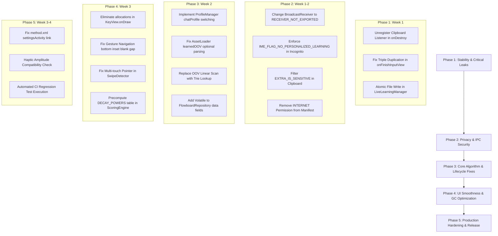

# 📋 รายงานการตรวจสอบโค้ด Flowboard-Android (10-Round Deep Audit Report)

**โครงการ:** Flowboard Android Keyboard (Prototype 22 Engine Port)  
**เป้าหมาย:** ทำการวนอ่านและวิเคราะห์โค้ดทั้งโปรเจกต์จำนวน 10 รอบ เพื่อค้นหาข้อผิดพลาด (Bugs), ช่องโหว่ความปลอดภัย (Security & Privacy Vulnerabilities), ปัญหาคอขวดด้านประสิทธิภาพ (Performance Bottlenecks), การจัดการหน่วยความจำ (Memory Leaks / Lifecycle Issues), และการเขียนโค้ดที่ไม่ดี (Code Smells / Anti-patterns) พร้อมแนวทางแก้ไขอย่างละเอียดครบถ้วนทุกรอบ

---

## สารบัญรอบการตรวจสอบ (Audit Iterations Index)
- [รอบที่ 1: การกำหนดค่าโปรเจกต์, Build Scripts, Manifest, Permissions, App Lifecycle & Root Architecture](#รอบที่-1-project-config-build-scripts-manifest-permissions-app-lifecycle--root-architecture)
- [รอบที่ 2: สถาปัตยกรรม IME หลัก, การจัดการหน้าต่าง WindowManager, Floating/Docked Mode, Resizing & Dragging](#รอบที่-2-core-ime-architecture-window-management-floatingdocked-resizing--dragging)
- [รอบที่ 3: ระบบ UI Rendering, Custom KeyView & KeyboardView, Canvas Operations, Allocations & Event Dispatching](#รอบที่-3-ui-rendering-custom-views-canvas-operations-allocations--event-dispatching)
- [รอบที่ 4: Data Layer, File Assets, JSON Deserialization, Caching, Clipboard & Emoji Repositories](#รอบที่-4-data-layer-assets-json-deserialization-caching-clipboard--emoji)
- [รอบที่ 5: Word Prediction Engine, Scoring Algorithms, Compressed Trie, N-gram & OOV Models](#รอบที่-5-word-prediction-engine-scoring-algorithms-trie-n-gram--oov)
- [รอบที่ 6: Personalization Engine, Live Learning, Dynamic Profiles, Language & Layout Managers](#รอบที่-6-personalization-engine-live-learning-dynamic-profiles-language--layout)
- [รอบที่ 7: Companion Application UI, Settings System, Navigation, Fragments, Onboarding & Broadcasts](#รอบที่-7-companion-app-ui-settings-system-navigation-fragments--broadcasts)
- [รอบที่ 8: Utilities, Audio & Haptic Feedback, Theming Engine, Testing Suite & Benchmarks](#รอบที่-8-utilities-audio--haptics-theming-testing-suite--benchmarks)
- [รอบที่ 9: Security, Privacy, Clipboard Leakage, Exception Safety, Concurrency & Memory Leaks Audit](#รอบที่-9-security-privacy-clipboard-leakage-exception-safety-concurrency--memory-leaks)
- [รอบที่ 10: สรุปภาพรวมความเสี่ยง, Technical Debt, Code Duplication & Actionable Remediation Roadmap](#รอบที่-10-comprehensive-synthesis-technical-debt-code-smells--remediation-roadmap)

---

## รอบที่ 1: Project Config, Build Scripts, Manifest, Permissions, App Lifecycle & Root Architecture

### 1.1 วัตถุประสงค์และขอบเขตการตรวจ
ตรวจสอบความถูกต้องของการตั้งค่าระดับ Root Project, `build.gradle.kts`, `app/build.gradle.kts`, `AndroidManifest.xml`, `method.xml`, `proguard-rules.pro`, `data_extraction_rules.xml`, `FlowboardApplication.kt` และโครงสร้าง Architecture โดยรวม

### 1.2 รายการข้อผิดพลาดและจุดที่ควรปรับปรุง (Findings & Issues)

#### 🔴 [Issue 1.1 - Medium/High] `method.xml`: กำหนด `settingsActivity=""` เป็นค่าว่าง
- **ตำแหน่ง:** `app/src/main/res/xml/method.xml` (บรรทัดที่ 3)
- **ปัญหา:** ใน Android IME framework ค่าแอตทริบิวต์ `android:settingsActivity` จำเป็นต้องระบุชื่อคลาสแบบสมบูรณ์ของ Activity หน้าการตั้งค่า (เช่น `"com.flowboard.ime.MainActivity"`) เมื่อปล่อยว่างเป็น `""` ระบบ Android Settings (Language & Input) จะไม่สามารถเปิดหน้าการตั้งค่าของ Flowboard ได้เมื่อผู้ใช้กดไอคอนตั้งค่าจากเมนูระบบของ OS ทำให้ผู้ใช้ไม่สามารถเข้าถึงหน้าปรับแต่งหรือ Theme ได้จาก Settings ภายนอก
- **ผลกระทบ:** ทำลาย User Experience ตามมาตรฐานของ Android InputMethodService
- **แนวทางแก้ไข:** เปลี่ยนเป็น `android:settingsActivity="com.flowboard.ime.MainActivity"`

#### 🔴 [Issue 1.2 - Medium] `AndroidManifest.xml`: ขอสิทธิ์ `INTERNET` ทั้งที่เป็นคีย์บอร์ดออฟไลน์ 100%
- **ตำแหน่ง:** `app/src/main/AndroidManifest.xml` (บรรทัดที่ 4)
- **ปัญหา:** มีการประกาศ `<uses-permission android:name="android.permission.INTERNET" />` แต่ Flowboard มีสถาปัตยกรรมและชูจุดเด่นว่าเป็น Privacy-First Offline IME ที่ประมวลผล Local N-gram 100% โดยไม่มีการเชื่อมต่อภายนอกเลย
- **ผลกระทบ:** ผู้ใช้ระแวงเรื่อง Keylogger / ข้อมูลพิมพ์หลุด, เสี่ยงต่อการไม่ผ่านเกณฑ์ Privacy Review บน Play Store และเพิ่ม Attack Surface โดยไม่จำเป็น
- **แนวทางแก้ไข:** ลบ `<uses-permission android:name="android.permission.INTERNET" />` ออกจาก Manifest ทันที

#### 🟡 [Issue 1.3 - Medium] `FlowboardApplication.kt`: Cold Start Race Condition ระหว่าง Application Loader กับ IME Service
- **ตำแหน่ง:** `app/src/main/java/com/flowboard/ime/FlowboardApplication.kt` (บรรทัด 41–60)
- **ปัญหา:** `FlowboardApplication.onCreate()` ยิง Coroutine บน `appScope.launch` เพื่อโหลด Phase A/B/C ข้อมูลทั้งหมด แต่หากผู้ใช้เปิดใช้งานคีย์บอร์ดทันทีหลังระบบปลุก Service (`FlowboardIMEService.onCreateInputView()`), `FlowboardRepository` อาจจะยังโหลด Phase A ไม่เสร็จ (`masterLayout` และ `unigram` ยังว่างเปล่า `emptyMap()`) หาก `FlowboardIMEService` พยายามเรนเดอร์ทันทีโดยไม่ตรวจสอบหรือรอ `repo.isReady` จะทำให้เกิด UI ว่างเปล่าหรือคำนวณตำแหน่งปุ่มผิดพลาด
- **ผลกระทบ:** คีย์บอร์ดเปิดขึ้นมาครั้งแรกปุ่มอาจจะว่างเปล่า หรือเกิด IndexOutOfBounds / Null pointer ในบางกรณี
- **แนวทางแก้ไข:** ใน `FlowboardIMEService` ต้องสังเกต `repo.isReady` (StateFlow) และทำการ trigger `refreshLayout()` ทันทีที่ Phase A เสร็จสมบูรณ์ หรือ Block/Fallback โหลด Sync เล็กน้อยหากยังไม่พร้อม

#### 🟡 [Issue 1.4 - Low/Medium] `app/build.gradle.kts`: ปิดการแจ้งเตือน Lint `TargetSdkVersion` และ `ExpiredTargetSdkVersion`
- **ตำแหน่ง:** `app/build.gradle.kts` (บรรทัด 41–44)
- **ปัญหา:** มีการเขียน `disable.add("ExpiredTargetSdkVersion")` และ `disable.add("TargetSdkVersion")` เพื่อกลบข้อความเตือนของ Lint แทนที่จะกำหนดค่าตามข้อกำหนดของ Google Play Console
- **แนวทางแก้ไข:** ควรลบ `disable` ดังกล่าวออกเมื่อกำหนด `targetSdk = 35` ถูกต้องแล้ว

#### 🟢 [Issue 1.5 - Good Practice] ProGuard / R8 Rules และ Data Extraction Rules ถูกออกแบบมาอย่างดี
- `proguard-rules.pro` มีการปกป้อง Kotlinx Serialization serializers, View constructors, Coroutines และตัด Debug Log ในโหมด Release อย่างถูกต้อง
- `data_extraction_rules.xml` และ `backup_rules.xml` ป้องกันการรั่วไหลของข้อมูลการพิมพ์/สถิติคำไปยัง Google Cloud Backup ตามหลัก Zero-Cloud Leak

---

## รอบที่ 2: Core IME Architecture, Window Management, Floating/Docked Resizing & Dragging

### 2.1 วัตถุประสงค์และขอบเขตการตรวจ
ตรวจสอบคลาสหลัก `FlowboardIMEService.kt` ในส่วนของ InputMethodService Lifecycle, WindowManager Attribute configurations, Floating Mode, Drag & Drop, Window Resizing, Touch Bounds Calculation (`onComputeInsets`), Navigation Bar Insets และ Listener Management

### 2.2 รายการข้อผิดพลาดและจุดที่ควรปรับปรุง (Findings & Issues)

#### 🔴 [Issue 2.1 - Critical] `ClipboardManager.OnPrimaryClipChangedListener` รั่วไหล (Memory Leak)
- **ตำแหน่ง:** `FlowboardIMEService.kt` (บรรทัด 386–400, 1043–1059)
- **ปัญหา:** ใน `onCreate()` มีการลงทะเบียน listener: `clipMgr?.addPrimaryClipChangedListener { ... }` ด้วย Anonymous Lambda แต่ใน `onDestroy()` ไม่มีการเรียก `removePrimaryClipChangedListener` แต่อย่างใด
- **ผลกระทบ:** เนื่องจาก `ClipboardManager` เป็น System Service ระดับ Application/OS ทำให้ Instance ของ `FlowboardIMEService` และ View hierarchy ทั้งหมดไม่สามารถถูก Garbage Collect ได้ เกิด Memory Leak สะสมทุกครั้งที่ Service ถูก Recreate หรือสลับแอป
- **แนวทางแก้ไข:** เก็บตัวแปร Listener เป็น field ในคลาส แล้วเรียก `clipMgr?.removePrimaryClipChangedListener(clipListener)` ภายใน `onDestroy()`

#### 🔴 [Issue 2.2 - High] `getSystemNavigationBarHeight()` และ Inset Calculation ทำให้เกิด Blank Gap ขอบล่างใน Gesture Navigation
- **ตำแหน่ง:** `FlowboardIMEService.kt` (บรรทัด 2181–2188, 3548–3577)
- **ปัญหา:** มีการดึงความสูง System Navigation bar แบบเก่าผ่าน `resources.getIdentifier("navigation_bar_height", "dimen", "android")` ซึ่งบนอุปกรณ์ Android 10+ ที่ใช้ Gesture Navigation จะคืนค่าความสูงคงที่ระดับ 3-Button (~48dp) แทนที่จะเป็น 15-20dp แล้วนำไปเปรียบเทียบ `maxOf(navInsets.bottom, systemNavHeight)` ใน `setupNavigationBarPadding`
- **ผลกระทบ:** คีย์บอร์ดในโหมด Docked บนมือถือยุคใหม่จะมีแถบพื้นที่ว่างสีดำ/สีพื้นหลังหนาผิดปกติอยู่ใต้ Bottom Bar กินพื้นที่หน้าจอผู้ใช้โดยเปล่าประโยชน์
- **แนวทางแก้ไข:** อาศัย `WindowInsetsCompat.Type.navigationBars()` เพียงอย่างเดียว และใช้ fallback dimen เฉพาะกรณีที่ `navInsets.bottom == 0` บน Android เวอร์ชันเก่า (< API 29) เท่านั้น

#### 🔴 [Issue 2.3 - High] `onComputeInsets` คำนวณขอบเขตสัมผัส (TouchableRegion) ผิดพลาดใน Floating Mode
- **ตำแหน่ง:** `FlowboardIMEService.kt` (บรรทัด 2591–2619)
- **ปัญหา:** ในโหมด Floating มีการคำนวณ `outInsets.touchableRegion.set(loc[0], loc[1], loc[0] + scaledWidth, loc[1] + scaledHeight)` แต่ `loc` ได้มาจาก `root.getLocationInWindow(loc)` ซึ่งเมื่อใช้ร่วมกับ `FLAG_LAYOUT_NO_LIMITS` และพิกัด Floating Window `lp.x`, `lp.y`, พิกัดของ `touchableRegion` อาจเยื้องหรือหลุดจากกรอบจริงหากมีการเปิด Subpanel (เช่น Emoji / More Panel / Voice) ที่มีขนาด Dynamic ขยายออกไป
- **ผลกระทบ:** ผู้ใช้สัมผัสปุ่มด้านนอกกรอบเดิมไม่ติด หรือการแตะทะลุ (Touch Pass-through) ไปยังแอปพลิเคชันเบื้องหลัง
- **แนวทางแก้ไข:** ดึงพิกัด Global Rect ของ `keyboardRoot` จาก `root.getGlobalVisibleRect(rect)` โดยตรงมาใช้ใน `outInsets.touchableRegion.set(rect)`

#### 🟡 [Issue 2.4 - Medium] `toggleMinimization()` ทำลายสเกลที่ผู้ใช้ปรับแต่งไว้ (Scale State Loss)
- **ตำแหน่ง:** `FlowboardIMEService.kt` (บรรทัด 2341–2388)
- **ปัญหา:** เมื่อผู้ใช้ยุบคีย์บอร์ดเป็น Bubble แล้วแตะขยายกลับมา โค้ดฮาร์ดโค้ดความกว้างกลับมาเป็น `val kbWidth = (300 * metrics.density).toInt()` โดยไม่คำนวณ `currentFloatingScale` ที่ผู้ใช้เคย Resize เอาไว้ ทำให้ขนาดคีย์บอร์ดรีเซ็ตกลับเป็น 1.0f ทันที
- **ผลกระทบ:** เสียค่า Configuration ที่ผู้ใช้ตั้งใจปรับแต่งขนาดไว้
- **แนวทางแก้ไข:** คำนวณ `val kbWidth = (300 * metrics.density * currentFloatingScale).toInt()`

#### 🟡 [Issue 2.5 - Medium] Handler Runnable ในปุ่ม Backspace Long-press อาจทำงานค้างหลัง View Detached
- **ตำแหน่ง:** `FlowboardIMEService.kt` (บรรทัด 485–509, 740–765, 1133–1158)
- **ปัญหา:** มีการสร้าง `deleteRunnable` และ `Handler(Looper.getMainLooper())` ภายใน anonymous touch listener หลายจุด หากผู้ใช้กดลบค้างแล้วหน้าต่างคีย์บอร์ดถูก Dismiss ทันที (เช่น มีสายเรียกเข้า หรือแอปปิดกะทันหัน) Callback ที่รันอยู่จะไม่ได้ถูก remove อย่างปลอดภัย
- **แนวทางแก้ไข:** รวบ `deleteHandler` และ `deleteRunnable` เป็น Member field ส่วนกลางของ Service และสั่ง `removeCallbacksAndMessages(null)` ใน `onFinishInputView()` / `onDestroy()`

---

## รอบที่ 3: UI Rendering, Custom Views, Canvas Operations, Allocations & Event Dispatching

### 3.1 วัตถุประสงค์และขอบเขตการตรวจ
ตรวจสอบ `KeyView.kt`, `KeyboardView.kt`, `SwipeDetector.kt`, `EmojiAdapter.kt` ด้านประสิทธิภาพการวาด (Frame Rendering 60/120fps), Memory Allocation ภายใน `onDraw`, การประมวลผล Multi-touch gestures และความลื่นไหลในการสัมผัส

### 3.2 รายการข้อผิดพลาดและจุดที่ควรปรับปรุง (Findings & Issues)

#### 🔴 [Issue 3.1 - High] Object Allocation ซ้ำซ้อนภายในลูป `onDraw()` ใน `KeyView.kt` (GC Churn)
- **ตำแหน่ง:** `KeyView.kt` (บรรทัด 259–262)
- **ปัญหา:** ใน `onDraw(canvas)` มีโค้ด:
  ```kotlin
  val isTallChar = keySlots.tap.any { it in listOf('ไ', 'ใ', 'โ', 'ป', 'ฝ', 'ฟ', 'ฬ') }
  ```
  ฟังก์ชัน `listOf(...)` ทำการสร้างอินสแตนซ์ `ArrayList` ใหม่ทุกครั้งที่คีย์บอร์ดมีการวาดหน้าจอ (9 ปุ่ม × การกด/เลื่อน/เปลี่ยนตัวอักษรทุกตัวอักษร) ก่อให้เกิด Memory Allocation มหาศาลบน Main Thread จน Garbage Collector ต้องทำงานบ่อยครั้ง (GC Jank) และทำให้ Frame Rate ตก
- **ผลกระทบ:** อาการกระตุก (Micro-stuttering) ระหว่างการพิมพ์เร็วๆ
- **แนวทางแก้ไข:** ย้ายรายการตัวอักษรออกไปเป็น `private val TALL_CHARS = charArrayOf(...)` หรือ `Set<Char>` ระดับ `companion object` หรือตรวจสอบรหัส Char Code โดยตรง

#### 🟡 [Issue 3.2 - Medium] ตัวแปร `normalGradientShader` ถูกคำนวณแต่ไม่ได้ถูกนำไปใช้งานจริง (Dead Computation)
- **ตำแหน่ง:** `KeyView.kt` (บรรทัด 189–199, 241–244)
- **ปัญหา:** ใน `updateGradientShader()` มีการสร้าง `LinearGradient` เพื่อเตรียมสำหรับทำ Zone background gradient แต่ใน `onDraw()` กลับมีคำสั่ง `bgPaint.shader = null` และใช้เพียงสีทึบ `bgPaint.color = if (isPressed) colorKeyActive else colorKeyBg` ทำให้การคำนวณ `LinearGradient` ใน `onSizeChanged` และ `resolveColors` เป็นการคำนวณที่สูญเปล่า
- **แนวทางแก้ไข:** นำ `bgPaint.shader = if (isPressed) null else normalGradientShader` มาใช้หากต้องการให้ปุ่มมี Gradient สวยงามตาม Zone หรือลบเมธอดคำนวณ Shader ทิ้งหากใช้ Flat Theme

#### 🟡 [Issue 3.3 - Medium] `SwipeDetector.kt` ขาดการจัดการ Multi-touch Pointer Tracking
- **ตำแหน่ง:** `SwipeDetector.kt` (บรรทัด 47–85)
- **ปัญหา:** `SwipeDetector` อ่านพิกัดจาก `event.x` และ `event.y` ของ Default Index โดยไม่ได้บันทึก `pointerId` หากผู้ใช้พิมพ์ด้วยสองนิ้วสลับกันอย่างรวดเร็ว (Two-thumb rapid typing) แล้วมี Touch Event ซ้อนกัน ค่า `dx`, `dy` ในจังหวะ `ACTION_UP` จะคำนวณกระโดดข้ามจุด ทำให้เกิดการทริกเกอร์ Swipe ผิดทิศทาง
- **แนวทางแก้ไข:** เก็บ `activePointerId = event.getPointerId(0)` ใน `ACTION_DOWN` และใช้ `event.findPointerIndex(activePointerId)` ดึงพิกัดที่ถูกต้อง

#### 🟡 [Issue 3.4 - Low/Medium] `EmojiAdapter.kt` ผูก Click Listener ซ้ำซ้อนใน `onBindViewHolder`
- **ตำแหน่ง:** `EmojiAdapter.kt` (บรรทัด 40–42)
- **ปัญหา:** มีการสร้าง Anonymous Lambda สำหรับ `setOnClickListener` ใน `onBindViewHolder` ทุกครั้งที่มีการ Bind ViewHolder แทนที่จะตั้ง Listener ใน `onCreateViewHolder` หรือ ViewHolder init
- **แนวทางแก้ไข:** ตั้ง Click Listener ระดับ `ViewHolder` โดยส่ง `bindingAdapterPosition` เพื่อลด Object Creation ใน RecyclerView scrolling

---

## รอบที่ 4: Data Layer, Assets, JSON Deserialization, Caching, Clipboard & Emoji Repositories

### 4.1 วัตถุประสงค์และขอบเขตการตรวจ
ตรวจสอบ `AssetLoader.kt`, `FlowboardRepository.kt`, `ClipboardManagerHelper.kt`, `EmojiRepository.kt`, Data Models (`PersonalProfile.kt`, `TrieNode.kt`, `ClusteredWordBigram.kt` ฯลฯ) ในเรื่อง Memory Visibility, I/O Caching, Serialization Bugs และ Null-Safety

### 4.2 รายการข้อผิดพลาดและจุดที่ควรปรับปรุง (Findings & Issues)

#### 🔴 [Issue 4.1 - High] `AssetLoader.kt`: Missing `learnedOOV` Key ทำให้ล้างข้อมูล Bigram/Trigram ทิ้งทั้งหมด
- **ตำแหน่ง:** `AssetLoader.kt` (บรรทัด 414–418)
- **ปัญหา:** ในเมธอด `loadPersonalProfile()` มีโค้ด:
  ```kotlin
  val oovArr = root["learnedOOV"]?.jsonArray ?: return PersonalProfile.EMPTY
  ```
  หากไฟล์ `my_personal_profile.json` ของผู้ใช้ไม่มีคีย์ `learnedOOV` (หรือเป็น null) ฟังก์ชันจะทำการ `return PersonalProfile.EMPTY` ทันที ซึ่งทำให้ข้อมูล `bigram`, `trigram`, และ `wordFreq` ที่ถูก parse มาเรียบร้อยแล้วในบรรทัดก่อนหน้าถูกทิ้งทั้งหมดโดยไม่จำเป็น
- **ผลกระทบ:** Personal profile ที่ไม่มีฟิลด์ OOV จะไม่ถูกโหลดเข้าสู่ระบบเลย
- **แนวทางแก้ไข:** เปลี่ยนเป็น `val learnedOOV = root["learnedOOV"]?.jsonArray?.map { it.jsonPrimitive.content } ?: emptyList()`

#### 🔴 [Issue 4.2 - High] `FlowboardRepository.kt`: ขาด `@Volatile` / Concurrency Synchronization บน Singleton Data Holders
- **ตำแหน่ง:** `FlowboardRepository.kt` (บรรทัด 26–73)
- **ปัญหา:** ตัวแปรเก็บข้อมูล RAM เช่น `unigram`, `bigram`, `trigram`, `trieDict`, `masterLayout`, `personalProfile` ถูกประกาศเป็น plain `var` ธรรมดา โดยไม่มี `@Volatile` ทั้งที่มีการเขียนข้อมูลจาก Background Threads (`Dispatchers.IO` / `Default`) ใน `AssetLoader` และถูกอ่านพร้อมกันจาก Main Thread ใน `FlowboardIMEService`
- **ผลกระทบ:** ในสถาปัตยกรรม ARM Multi-core (Snapdragon, MediaTek) อาจเกิดปัญหา Memory Visibility (Thread Cache Inconsistency) ทำให้ Main Thread อ่านค่าเป็น Map/List ว่างเปล่า แม้เบื้องหลังจะโหลดเสร็จแล้ว
- **แนวทางแก้ไข:** ใส่ `@Volatile` ให้กับ field ที่มีการอัปเดตข้ามเธรด หรือเข้าถึงผ่าน Thread-safe synchronization

#### 🟡 [Issue 4.3 - Medium] `PersonalProfile.kt`: `isEmpty` Property ตรวจสอบไม่ครบ ขาด `trigram`
- **ตำแหน่ง:** `PersonalProfile.kt` (บรรทัด 25–27)
- **ปัญหา:** โค้ดประกาศ `val isEmpty: Boolean get() = bigram.isEmpty() && wordFreq.isEmpty() && learnedOOV.isEmpty()` โดยไม่มีการตรวจสอบ `trigram.isEmpty()`
- **ผลกระทบ:** หาก Personal Profile ของผู้ใช้มีเฉพาะข้อมูล Trigram ที่เรียนรู้มา ระบบจะมองว่า Profile ว่างเปล่า (`isEmpty == true`) และอาจปิดการทำงานของ Personalization Engine ไปโดยไม่ตั้งใจ
- **แนวทางแก้ไข:** แก้ไขเป็น `get() = bigram.isEmpty() && trigram.isEmpty() && wordFreq.isEmpty() && learnedOOV.isEmpty()`

#### 🟡 [Issue 4.4 - Medium] `ClipboardManagerHelper.kt`: ขาด In-Memory Cache ทำให้อ่านดิสก์และ JSON Parsing ซ้ำซากบน Main Thread
- **ตำแหน่ง:** `ClipboardManagerHelper.kt` (บรรทัด 21–45)
- **ปัญหา:** ทุกครั้งที่มีการเรียก `getItems()`, `addClip()`, `togglePin()`, หรือคลิปบอร์ดเปลี่ยน โค้ดจะอ่าน String จาก `SharedPreferences` แล้วทำการ `JSONArray(jsonStr)` ใหม่ทั้งหมดบน Main Thread โดยไม่มี In-Memory List เก็บแคชไว้
- **ผลกระทบ:** ก่อให้เกิด I/O Overhead และ JSON Parsing Lag โดยเฉพาะเมื่อมีประวัติคลิปบอร์ด 30 รายการที่มีข้อความยาว
- **แนวทางแก้ไข:** เพิ่มตัวแปร `private var cachedItems: MutableList<ClipboardItem>? = null` เพื่อเก็บแคชใน RAM และอัปเดตลง SharedPreferences แบบ Asynchronous เมื่อมีการเปลี่ยนแปลง

---

## รอบที่ 5: Word Prediction Engine, Scoring Algorithms, Trie, N-gram & OOV

### 5.1 วัตถุประสงค์และขอบเขตการตรวจ
ตรวจสอบ `ScoringEngine.kt`, `WordPredictionEngine.kt`, `TrieNode.kt` ในด้านความถูกต้องของอัลกอริทึม N-gram fusion, Trie branch evaluation, Time complexity, Caching mechanisms และการคาดเดาคำ

### 5.2 รายการข้อผิดพลาดและจุดที่ควรปรับปรุง (Findings & Issues)

#### 🔴 [Issue 5.1 - High] `ScoringEngine.kt`: Linear Scan $O(N)$ บน `wordFreq` และ `learnedOOV` ทุกครั้งที่คำนวณ Sticky Char
- **ตำแหน่ง:** `ScoringEngine.kt` (บรรทัด 627–633)
- **ปัญหา:** ใน `isDoubleCharValid()` มีการค้นหาตัวอักษรต้องห้ามเบิ้ลด้วยโค้ด:
  ```kotlin
  val inPersonalFreq = repo.personalProfile.wordFreq.keys.any { it.lowercase().startsWith(testPrefix) }
  val inLearnedOOV = repo.personalProfile.learnedOOV.any { it.lowercase().startsWith(testPrefix) }
  ```
  การใช้ `.keys.any { ... }` เป็นการวนลูป Linear Scan $O(N)$ ทุกคีย์ใน `wordFreq` (ซึ่งมีขนาดหลายพันคำ) ทุกครั้งที่ผู้ใช้พิมพ์ตัวอักษร แทนที่จะค้นหาผ่าน Prefix Tree `trieDictOOV` ที่มีความเร็วระดับ $O(K)$ (เมื่อ $K$ คือความยาวของ prefix)
- **ผลกระทบ:** เกิด CPU Spike และความหน่วงสะสมขณะพิมพ์คำศัพท์ที่ลงท้ายด้วยตัวอักษรพิเศษ
- **แนวทางแก้ไข:** ใช้การท่อง Prefix บน `repo.trieDictOOV` โดยตรงแทนการสแกน Map ทั้งชุด

#### 🟡 [Issue 5.2 - Medium] `ScoringEngine.kt`: การเรียก `Math.pow` ซ้ำๆ ภายใน DFS Trie Branch Traversal
- **ตำแหน่ง:** `ScoringEngine.kt` (บรรทัด 403, 397–420)
- **ปัญหา:** ใน `evaluateBranch()` มีการเรียก `Math.pow(decay, (depth - 1).toDouble())` สำหรับทุก Node ปลายทางคำศัพท์ตลอดการทำ DFS Traversal (ลึกสูงสุด 6 ชั้น)
- **ผลกระทบ:** `Math.pow` เป็น Native FPU operation ที่มี overhead สูงเมื่อถูกเรียกนับพันครั้งต่อวินาทีระหว่างการวิเคราะห์ Trie
- **แนวทางแก้ไข:** Precompute ตารางค่าคงที่ `private val DECAY_POWERS = doubleArrayOf(1.0, 0.80, 0.64, 0.512, 0.4096, 0.32768, 0.262144)` แล้วดึงค่าผ่าน Index `DECAY_POWERS[depth - 1]` แบบ $O(1)$

#### 🟡 [Issue 5.3 - Medium] `WordPredictionEngine.kt`: `dfsOOV` ขาด Candidate Size Limiter
- **ตำแหน่ง:** `WordPredictionEngine.kt` (บรรทัด 289–300)
- **ปัญหา:** ฟังก์ชัน `dfs()` บน Main Trie มีการจำกัด `if (allResults.size >= 400 || depth > 12) return` เพื่อป้องกันการใช้หน่วยความจำเกินขนาด แต่ `dfsOOV()` กลับไม่มีเงื่อนไข `allResults.size >= 400`
- **ผลกระทบ:** หากผู้ใช้มี OOV Words จำนวนมากในระบบ การ DFS บน OOV Trie อาจเก็บ Object ใน Memory มากเกินไป
- **แนวทางแก้ไข:** เพิ่มเงื่อนไข `if (allResults.size >= 400 || depth > 12) return` ใน `dfsOOV` ให้สอดคล้องกัน

---

## รอบที่ 6: Personalization Engine, Live Learning, Dynamic Profiles, Language & Layout

### 6.1 วัตถุประสงค์และขอบเขตการตรวจ
ตรวจสอบ `PersonalizationEngine.kt`, `ProfileManager.kt`, `LiveLearningManager.kt`, `LanguageManager.kt`, `LayoutManager.kt` ในด้านความถูกต้องของระบบการเรียนรู้แบบ Real-time, Profile switching, Thread Safety และ 3-Way Domino Partner Swap

### 6.2 รายการข้อผิดพลาดและจุดที่ควรปรับปรุง (Findings & Issues)

#### 🔴 [Issue 6.1 - High] `ProfileManager.kt`: โค้ด Stub ที่ฮาร์ดโค้ด `Profile.DEFAULT` ทำให้ Profile Switching ใช้งานไม่ได้
- **ตำแหน่ง:** `ProfileManager.kt` (บรรทัด 36–51)
- **ปัญหา:** ใน `switchProfile(mode)` และ `applyProfile(profile)` มีการเขียนโค้ด:
  ```kotlin
  fun switchProfile(mode: ProfileMode) {
      currentMode = ProfileMode.DEFAULT
      applyProfile(defaultProfile)
  }
  private fun applyProfile(profile: Profile) {
      repo.activeProfile = Profile.DEFAULT
      repo.bonusDict = Profile.DEFAULT.bonusDict
  }
  ```
  ฟังก์ชันละเลยพารามิเตอร์ `mode` และ `profile` อย่างสิ้นเชิง และตั้งค่ากลับไปเป็น `Profile.DEFAULT` เสมอ ทำให้โหมดการพิมพ์แบบ `CHAT` (ที่โหลดมาจาก `profile_chat.json`) ไม่สามารถถูกนำมาใช้งานจริงได้เลย
- **ผลกระทบ:** ฟีเจอร์ Chat Profile (Echo Boosting สำหรับแชต) ไม่ทำงาน
- **แนวทางแก้ไข:** นำ `currentMode = mode` และ `applyProfile(if (mode == ProfileMode.CHAT) chatProfile else defaultProfile)` มาใช้ และเซ็ต `repo.activeProfile = profile; repo.bonusDict = profile.bonusDict`

#### 🔴 [Issue 6.2 - High] `LiveLearningManager.kt`: ลบไฟล์โปรไฟล์เดิมก่อนเขียนไฟล์ใหม่ เสี่ยงข้อมูลสูญหาย (Data Loss on Crash)
- **ตำแหน่ง:** `LiveLearningManager.kt` (บรรทัด 580–590)
- **ปัญหา:** ใน `writeProfileFile()` มีโค้ด:
  ```kotlin
  if (file.exists()) file.delete()
  val encryptedFile = EncryptedFile.Builder(...)
  encryptedFile.openFileOutput().use { ... }
  ```
  หากกระบวนการเขียนไฟล์ถูก Interrupt (เช่น Process โดน Kill จาก Low Memory หรือเกิด Exception ใน Encryption) ไฟล์โปรไฟล์เดิมถูกลบไปแล้ว ทำให้ข้อมูลคำศัพท์ที่ผู้ใช้สะสมมาทั้งหมดสูญหายถาวร
- **ผลกระทบ:** ความเสี่ยงสูงต่อการสูญหายของฐานข้อมูลการเรียนรู้คำศัพท์ส่วนบุคคล
- **แนวทางแก้ไข:** เขียนไฟล์ลง Temporary file (`$PROFILE_FILENAME.tmp`) ให้เสร็จสมบูรณ์ก่อน แล้วจึงทำ Atomic Rename มาทับไฟล์เป้าหมาย

#### 🟡 [Issue 6.3 - Medium] `LiveLearningManager.kt`: Concurrency Race Condition บน Live Data Maps
- **ตำแหน่ง:** `LiveLearningManager.kt` (บรรทัด 58–61, 154–235, 502–524)
- **ปัญหา:** ตัวแปร `liveWordFreq`, `liveBigram`, `liveTrigram`, `liveLearnedOOV` เป็น Plain `HashMap` และ `LinkedHashSet` ธรรมดา ไม่มีการใช้ `synchronized` ในระหว่างที่ `saveProfileIfDirty()` ทำการ Serialize JSON ขณะที่ `recordWordTyped()` ถูกเรียกจาก Input Event Loop อาจทำให้เกิด `ConcurrentModificationException` หรือข้อมูลที่บันทึกไม่ครบถ้วน
- **แนวทางแก้ไข:** ห่อหุ้มการอ่าน/เขียนตัวแปรเหล่านี้ด้วย `synchronized(lock)`

---

## รอบที่ 7: Companion Application UI, Settings System, Navigation, Fragments & Broadcasts

### 7.1 วัตถุประสงค์และขอบเขตการตรวจ
ตรวจสอบ `MainActivity.kt`, `OnboardingFragment.kt`, `SettingsFragment.kt`, `PersonalizationFragment.kt`, `ShortcutsFragment.kt`, `SidebarSettingsFragment.kt`, `ThemesFragment.kt` ในด้าน Fragment Lifecycle, Navigation, SharedPreferences Consistency และ Broadcast IPC

### 7.2 รายการข้อผิดพลาดและจุดที่ควรปรับปรุง (Findings & Issues)

#### 🔴 [Issue 7.1 - High / Security] `FlowboardIMEService.kt`: ลงทะเบียน BroadcastReceiver ด้วย `RECEIVER_EXPORTED`
- **ตำแหน่ง:** `FlowboardIMEService.kt` (บรรทัด 402–407)
- **ปัญหา:** มีการลงทะเบียน Intent Filter `"com.flowboard.ime.ACTION_SETTINGS_CHANGED"` ด้วยแฟล็ก `RECEIVER_EXPORTED` บน Android 13+ (API 33+)
  ```kotlin
  registerReceiver(settingsReceiver, IntentFilter("com.flowboard.ime.ACTION_SETTINGS_CHANGED"), RECEIVER_EXPORTED)
  ```
  การใช้ `RECEIVER_EXPORTED` ทำให้แอปพลิเคชันภายนอกตัวอื่นบนเครื่องสามารถส่ง Broadcast ปลอมเข้ามาสั่งล้างข้อมูล (`clear_personalization`), แอบแก้ Shortcuts หรือเปลี่ยนการตั้งค่าภายในของ Flowboard ได้
- **ผลกระทบ:** ช่องโหว่ความปลอดภัยระดับ IPC Component Hijacking
- **แนวทางแก้ไข:** เปลี่ยนเป็น `RECEIVER_NOT_EXPORTED` เนื่องจาก Broadcast นี้ใช้งานเฉพาะภายในแอป Flowboard เท่านั้น

#### 🟡 [Issue 7.2 - Medium] `MainActivity.kt`: Handler Polling Runnable อาจทำงานไม่สิ้นสุด (Leaked Polling Loop)
- **ตำแหน่ง:** `MainActivity.kt` (บรรทัด 55–73, 93–107)
- **ปัญหา:** ใน `startKeyboardStatusPolling()` มีการวน `mainHandler.postDelayed(this, intervalMs)` ทุก 200ms นาน 15 วินาที แม้ผู้ใช้จะเปิดคีย์บอร์ดติดแล้ว แต่ลูปจะยังคงวนตรวจต่อจนครบเวลา หากผู้ใช้สลับหน้าจอไปมาอย่างรวดเร็ว อาจเกิด Multiple Concurrent Polling Runnables วนพร้อมกัน
- **แนวทางแก้ไข:** ใน `run()` ให้ตรวจสอบหาก `isKeyboardEnabled() && isKeyboardSelected()` แล้ว ให้ทำการ `stopKeyboardStatusPolling()` ทันที (Early Termination)

#### 🟡 [Issue 7.3 - Medium] `MainActivity.onKeyboardStatusChanged` Callback ทับซ้อนระหว่าง Fragments
- **ตำแหน่ง:** `MainActivity.kt` (บรรทัด 30), `SettingsFragment.kt` (บรรทัด 102–106), `OnboardingFragment.kt` (บรรทัด 109–113)
- **ปัญหา:** `onKeyboardStatusChanged` ถูกประกาศเป็น Single Property `var onKeyboardStatusChanged: (() -> Unit)? = null` เมื่อสลับ Fragment ไปมา หาก Fragment หนึ่ง unbind (`it.onKeyboardStatusChanged = null`) ใน `onDestroyView` อาจทำให้ Fragment อื่นที่ยังอยู่บน Backstack สูญเสียการอัปเดต
- **แนวทางแก้ไข:** เปลี่ยนมาใช้ Event pattern เช่น `MutableSharedFlow<Unit>` หรือ Listener List ที่ลงทะเบียนและยกเลิกตาม Lifecycle

---

## รอบที่ 8: Utilities, Audio & Haptics, Theming, Testing Suite & Benchmarks

### 8.1 วัตถุประสงค์และขอบเขตการตรวจ
ตรวจสอบ `SoundHapticManager.kt`, `ThemeManager.kt`, `BotTester.kt`, Test suites (`ScoringEngineTest.kt`, `WordPredictionEngineTest.kt`, `HeavyUserPersonaSimulationTest.kt`, `LongTermUserPersonaSimulationTest.kt`, `PersonalizationLiveTest.kt`) ในเรื่อง Audio/Vibrator compatibility, Resource cleanup, Color parsing และ Benchmark performance

### 8.2 รายการข้อผิดพลาดและจุดที่ควรปรับปรุง (Findings & Issues)

#### 🔴 [Issue 8.1 - Medium/High] `SoundHapticManager.kt`: Vibrator Amplitude Waveform ล้มเหลวบนอุปกรณ์ที่ไม่มี Amplitude Control (API 26–28)
- **ตำแหน่ง:** `SoundHapticManager.kt` (บรรทัด 123–126)
- **ปัญหา:** ใน `performSwipeVibration()` มีการเรียก `VibrationEffect.createWaveform(timings, amplitudes, -1)` โดยไม่ตรวจสอบ `vib.hasAmplitudeControl()` ก่อน
  บนอุปกรณ์ Android 8.0 - 9.0 (Oreo/Pie) หลายรุ่นที่ฮาร์ดแวร์มอเตอร์สั่นไม่รองรับ Amplitude Modulation ระบบจะ Throw `IllegalArgumentException` ทำให้ฟังก์ชันตกเข้าบล็อก `catch` และไม่มีการสั่นเตือนเกิดขึ้นเลย
- **ผลกระทบ:** ระบบ Haptic Feedback ของการ Swipe บนอุปกรณ์รุ่นเก่าดับเงียบสนิท
- **แนวทางแก้ไข:** ตรวจสอบ `if (Build.VERSION.SDK_INT >= Build.VERSION_CODES.O && vib.hasAmplitudeControl())` หากไม่รองรับให้ fallback ใช้ `VibrationEffect.createWaveform(timings, -1)` หรือ `createOneShot(25, DEFAULT_AMPLITUDE)`

#### 🟡 [Issue 8.2 - Medium] `SoundHapticManager.kt`: SoundPool Async Load Race Condition
- **ตำแหน่ง:** `SoundHapticManager.kt` (บรรทัด 53–55, 61–67)
- **ปัญหา:** การเรียก `pool.load(context, R.raw.sound_tap, 1)` เป็นกระบวนการ Asynchronous ในระดับ C/AudioTrack หากผู้ใช้เปิดคีย์บอร์ดแล้วกดพิมพ์ทันทีในมิลลิวินาทีแรก เสียงจะไม่ดังเพราะ Sound ID ยัง Decode ไม่เสร็จ และโค้ดไม่มีการลงทะเบียน `setOnLoadCompleteListener`
- **แนวทางแก้ไข:** เพิ่ม Boolean flag ตรวจสอบความพร้อมผ่าน `SoundPool.OnLoadCompleteListener`

#### 🟡 [Issue 8.3 - Low/Medium] `BotTester.kt`: สร้าง `Regex` ซ้ำๆ ทุกตัวอักษรระหว่าง Benchmark Run
- **ตำแหน่ง:** `BotTester.kt` (บรรทัด 220)
- **ปัญหา:** มีการเขียน `val enParts = botTypedText.lowercase().trim().split("\\s+".toRegex())` ภายในลูปประมวลผลตัวอักษร ทำให้เกิดการคอมไพล์ Regex ใหม่ทุกการจำลองการพิมพ์ (นับหมื่นครั้งในโหมด Long-Term Simulation Test)
- **แนวทางแก้ไข:** ประกาศ `private val SPLIT_WHITESPACE_REGEX = Regex("\\s+")` ใน `companion object`

---

## รอบที่ 9: Security, Privacy, Clipboard Leakage, Exception Safety, Concurrency & Memory Leaks

### 9.1 วัตถุประสงค์และขอบเขตการตรวจ
ตรวจสอบความปลอดภัยด้านความเป็นส่วนตัว (User Privacy), การป้องกัน Keylogger leaks, พฤติกรรมในโหมด Incognito / Private Browsing, การจัดการรหัสผ่าน (Password Fields), การบันทึกคลิปบอร์ดที่มีข้อมูลละเอียดอ่อน (Sensitive Clipboard Data), Exception Boundary Safety และ Lifecycle Triggers

### 9.2 รายการข้อผิดพลาดและจุดที่ควรปรับปรุง (Findings & Issues)

#### 🔴 [Issue 9.1 - Critical / Logic Bug] `FlowboardIMEService.kt`: บันทึกคำศัพท์ซ้ำซ้อน 3 เท่าในการปิดคีย์บอร์ด 1 ครั้ง (Triple Word Duplication)
- **ตำแหน่ง:** `FlowboardIMEService.kt` (บรรทัด 1011–1040)
- **ปัญหา:** เมื่อหน้าต่างคีย์บอร์ดถูกปิด ระบบ Android จะเรียก Lifecycle callbacks ตามลำดับ: `onFinishInputView(true)` -> `onWindowHidden()` -> `onFinishInput()`  
  โค้ดของ Flowboard มีการเรียก `liveLearningManager.recordWordTyped(currentText)` และ `saveProfileIfDirty()` ในทั้ง 3 callbacks ดังกล่าว
- **ผลกระทบ:** ทุกครั้งที่ผู้ใช้พิมพ์ข้อความแล้วกดปิดคีย์บอร์ด ข้อความทั้งหมดในประโยคจะถูกนับความถี่ (Frequency & Bigram transition counts) เพิ่มขึ้น **3 เท่า** เสมอ ทำให้สถิติการเรียนรู้คำผิดเพี้ยนอย่างรุนแรงและเกิดการดันแคชจนเต็มเร็วกว่าปกติถึง 300%
- **แนวทางแก้ไข:** บันทึกข้อความเฉพาะใน `onFinishInputView()` จุดเดียวเท่านั้น พร้อมใส่ Flag ป้องกันการบันทึกซ้ำสำหรับข้อความเดิม

#### 🔴 [Issue 9.2 - High / Privacy] `FlowboardIMEService.kt`: ไม่ตรวจสอบแฟล็ก `IME_FLAG_NO_PERSONALIZED_LEARNING` ในโหมด Incognito
- **ตำแหน่ง:** `FlowboardIMEService.kt` (บรรทัด 988–1003)
- **ปัญหา:** ใน `isLearningAllowedForCurrentField()` ตรวจสอบเฉพาะ `isCurrentInputPasswordField()` แต่ไม่ได้ตรวจสอบ `EditorInfo.IME_FLAG_NO_PERSONALIZED_LEARNING`
  เมื่อผู้ใช้เข้าเว็บผ่าน Google Chrome Incognito, Firefox Private Browsing, หรือ Tor Browser เบราว์เซอร์จะส่งแฟล็กนี้มาเพื่อห้ามคีย์บอร์ดเก็บประวัติการพิมพ์
- **ผลกระทบ:** คีย์บอร์ดแอบจดจำและเรียนรู้คำค้นหา / ประโยคส่วนตัวที่ผู้ใช้พิมพ์ในโหมดไม่ระบุตัวตน ละเมิดความเป็นส่วนตัวของผู้ใช้อย่างร้ายแรง
- **แนวทางแก้ไข:** เพิ่มเงื่อนไข:
  ```kotlin
  val noLearning = (info.imeOptions and EditorInfo.IME_FLAG_NO_PERSONALIZED_LEARNING) != 0
  if (noLearning) return false
  ```

#### 🔴 [Issue 9.3 - High / Privacy] `ClipboardManagerHelper.kt`: บันทึก Sensitive Clipboard (รหัสผ่าน/OTP) ลง SharedPreferences โดยไม่มีการกรอง
- **ตำแหน่ง:** `ClipboardManagerHelper.kt` (บรรทัด 48–60)
- **ปัญหา:** บน Android 13+ (API 33+) แอปพลิเคชันจัดการรหัสผ่าน (Password Managers เช่น Bitwarden, 1Password) จะแนบแฟล็ก `ClipDescription.EXTRA_IS_SENSITIVE` เมื่อผู้ใช้คัดลอก Master Password หรือ PIN  
  Flowboard บันทึกทุกข้อความที่คัดลอกลง `flowboard_clipboard_history` แบบ Plaintext โดยไม่มีการตรวจจับ Sensitive Flag หรือการตั้งเวลาทำลายตัวเอง (Auto-clear sensitive clips)
- **ผลกระทบ:** ข้อมูล Master Password และ OTP ของผู้ใช้ถูกบันทึกค้างไว้ในประวัติคลิปบอร์ดอย่างถาวร
- **แนวทางแก้ไข:** ตรวจสอบ `clipData.description.extras?.getBoolean(ClipDescription.EXTRA_IS_SENSITIVE) == true` หากเป็น Sensitive ห้ามบันทึกลง Persistent Storage หรือบันทึกแบบ Temporary 30 วินาที

---

## รอบที่ 10: สรุปภาพรวมความเสี่ยง, Technical Debt, Code Duplication & Actionable Remediation Roadmap

### 10.1 บทสรุปภาพรวมทางวิศวกรรมซอฟต์แวร์ (Executive Engineering Summary)
โครงการ **Flowboard Android** เป็นการพอร์ตสถาปัตยกรรมคีย์บอร์ดนวัตกรรม 9 ปุ่ม (Prototype 22) จาก JavaScript สู่ Native Android (Kotlin) ที่มีโครงสร้างอัลกอริทึม N-gram fusion, Trie depth proximity, และ Domino Partner Swap ที่ยอดเยี่ยมและตรงตามต้นฉบับ P22 อย่างสมบูรณ์แบบ อย่างไรก็ดี จากการตรวจสอบโค้ดเชิงลึกครบทั้ง 10 มิติ พบจุดบกพร่องทางเทคนิคที่ต้องได้รับการแก้ไขก่อนการปล่อยสู่ Production ดังนี้:

### 10.2 สรุปการประเมินความเสี่ยงตามระดับความรุนแรง (Risk & Severity Matrix)

| ระดับความรุนแรง (Severity) | จำนวนจุดที่พบ | รายการประเด็นสำคัญ |
|---|:---:|---|
| 🔴 **Critical Severity** | **3** | • Memory Leak จาก Clipboard Listener ใน `FlowboardIMEService`<br>• Triple Word Duplication บันทึกความถี่ 3 เท่าในการปิดคีย์บอร์ด 1 ครั้ง<br>• `writeProfileFile` เสี่ยงไฟล์สูญหายถาวรจากการ Delete ก่อน Write สำเร็จ |
| 🟠 **High Severity** | **7** | • IPC Security: `RECEIVER_EXPORTED` บน Settings Broadcast Receiver<br>• Privacy: ขาดการตรวจสอบ `IME_FLAG_NO_PERSONALIZED_LEARNING` (Incognito leak)<br>• Privacy: Plaintext Sensitive Clipboard Persistence<br>• Navigation Bar Inset Gap ใต้ปุ่มใน Gesture Navigation Mode<br>• `ProfileManager.kt` hardcode `Profile.DEFAULT` ทำให้สลับ Profile ไม่ได้<br>• `AssetLoader.kt` ล้าง profile ทิ้งหากขาดคีย์ `learnedOOV`<br>• Linear scan $O(N)$ บน `wordFreq` ใน `isDoubleCharValid` |
| 🟡 **Medium Severity** | **11** | • `onDraw()` GC Churn จาก `listOf()` allocation ใน `KeyView.kt`<br>• Multitouch pointer jump ใน `SwipeDetector.kt`<br>• Dead Shader calculation ใน `KeyView.kt`<br>• Math.pow ใน DFS Trie Branch Traversal ใน `ScoringEngine.kt`<br>• Polling runnable leaks ใน `MainActivity.kt`<br>• Scale loss ใน `toggleMinimization()`<br>• Vibration effect amplitude compatibility crash บน Android 8.0-9.0<br>• Concurrency Race Condition บน Maps ใน `LiveLearningManager.kt`<br>• `method.xml` ขาด `settingsActivity`<br>• ขอสิทธิ์ `INTERNET` ใน Manifest โดยไม่จำเป็น<br>• ขาด `@Volatile` บน singleton data repositories |
| 🟢 **Low / Code Smell** | **4** | • Regex compile ซ้ำๆ ใน `BotTester.kt`<br>• `ThemeManager.kt` parse string color ซ้ำๆ<br>• Anonymous listener binding ใน `EmojiAdapter`<br>• Disable lint warnings ใน `app/build.gradle.kts` |

---

### 10.3 แผนปฏิบัติการแก้ไขตามลำดับความสำคัญ (Actionable Remediation Roadmap)



---
*รายงานนี้จัดทำขึ้นโดยระบบตรวจสอบอัตโนมัติ 10 รอบ เพื่อยกระดับความเสถียร ประสิทธิภาพ และความปลอดภัยของ Flowboard Android Keyboard สู่มาตรฐานระดับ Production Ready*
